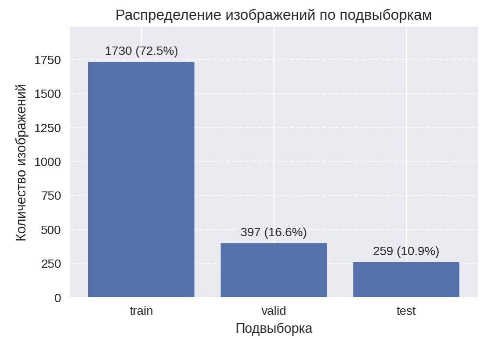
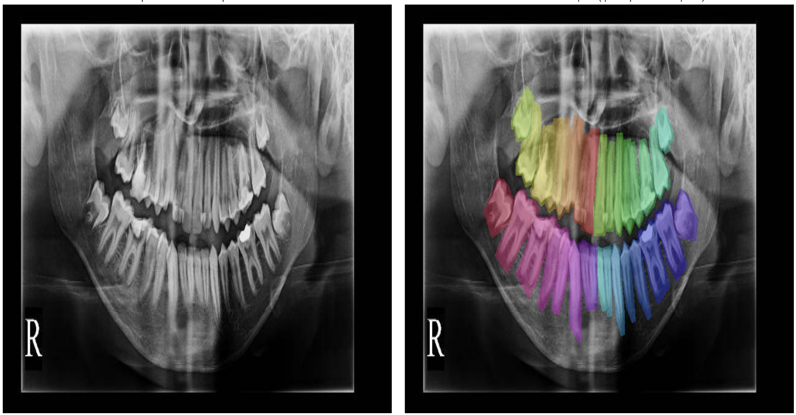
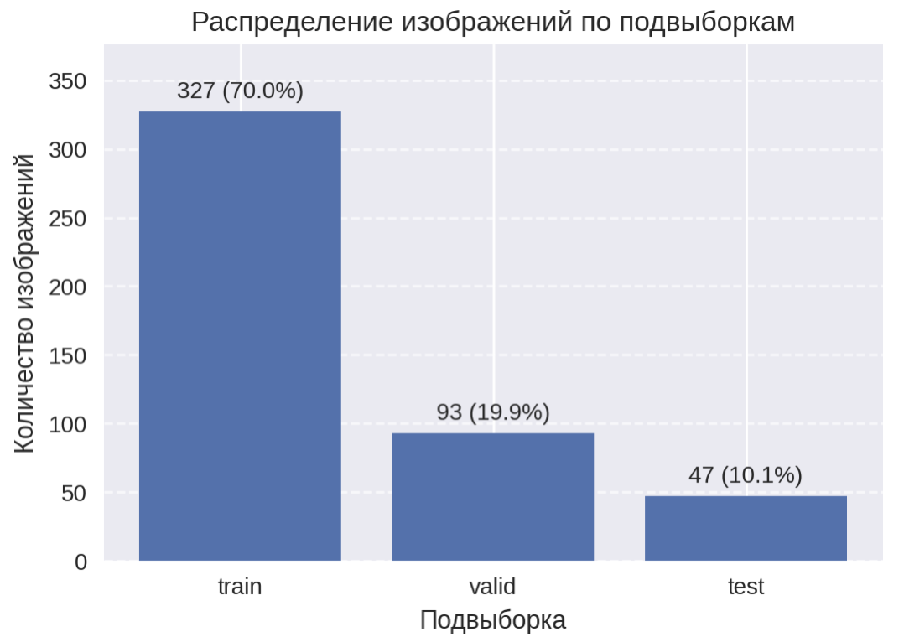
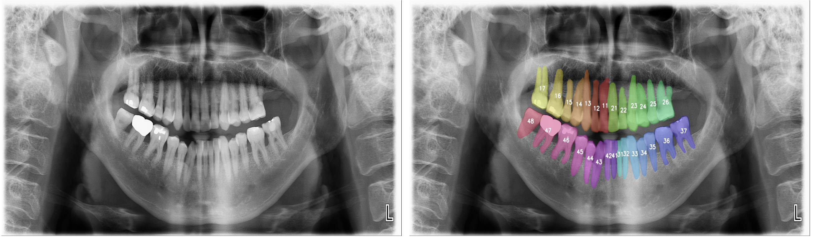
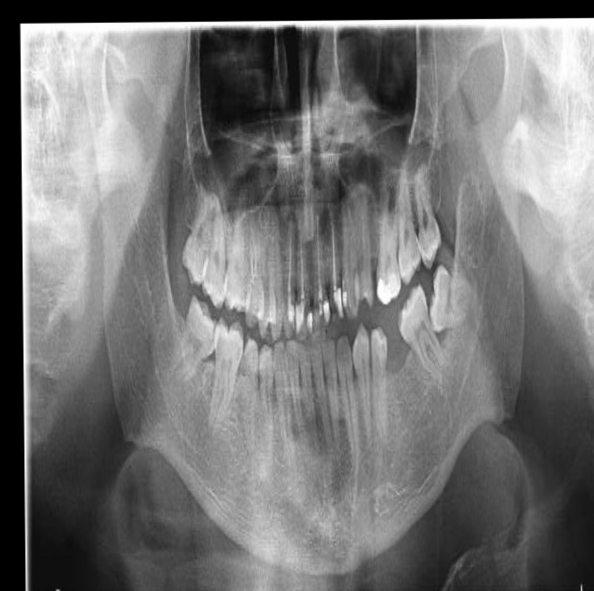
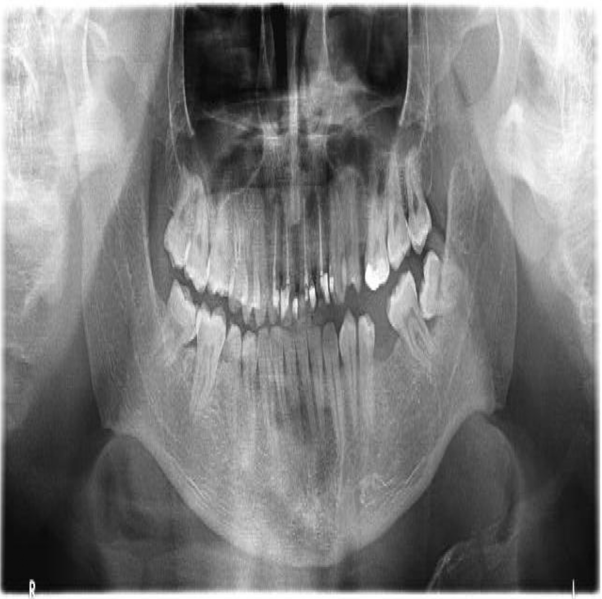
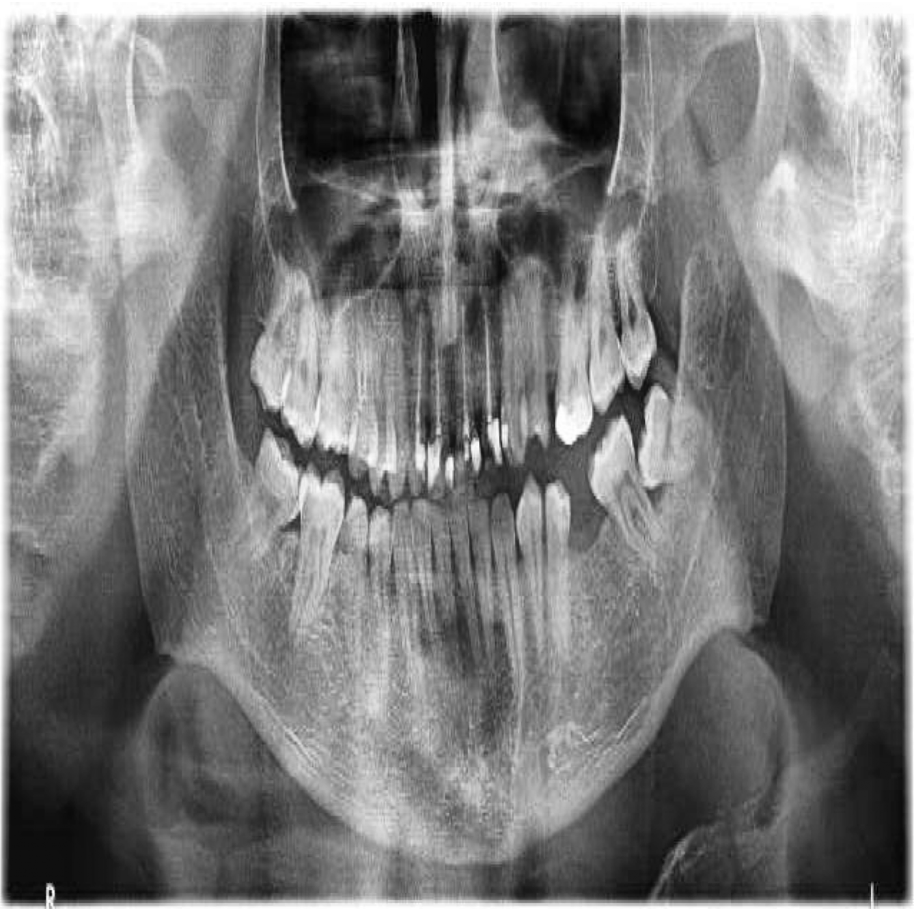
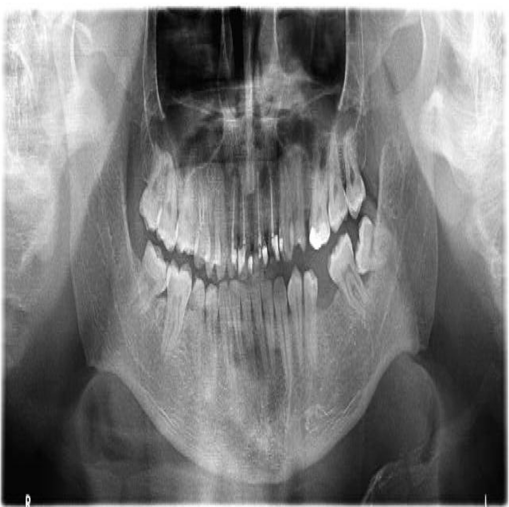
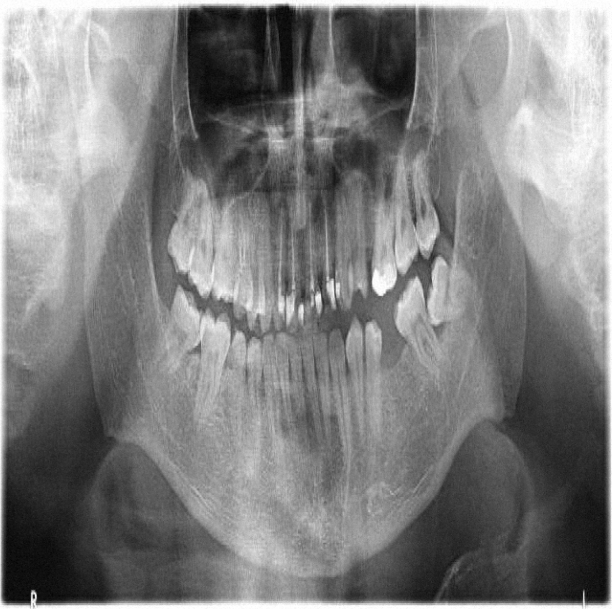

# Датасет для обучения и используемые аугментации
## Структура раздела
- `00_Dataset_01.ipynb` - для анализа и визуализации датасета **teeth-seg-3537 Computer Vision Model**
- `00_Dataset_02.ipynb` - для анализа и визуализации датасета **teeth Computer Vision Dataset**
- `00_Dataset_01_augmentation.ipynb` - для настройки и визуализации аугментаций

# Датасет для решения задачи сегментации зубов

Датасет, который будет использован для обучения модели, должен удовлетворять ряду требований:
- содержать большое количество изображений, прежде всего взрослых пациентов
- быть размеченным 
- лицензия должна позволять использование его в коммерческих целях

На Roboflow было обнаружено два подходящих датасета: **teeth-seg-3537 Computer Vision Model** (автор [Godento2](https://universe.roboflow.com/godento2)) и **teeth Computer Vision Dataset** (автор [Chosun University](https://universe.roboflow.com/chosun-university-n0qpz)). 

## teeth-seg-3537 Computer Vision Model (автор [Godento2](https://universe.roboflow.com/godento2))
- это крупный датасет, содержащий в оригинале более 3500 снимков, однако в нем присутствуют детские снимки. После очистки от детских ортопантомограмм датасет содержит 2300 снимков: train / val / test = 1730 / 397 / 259;
- размер изображений 640х640
- лицензия СС BY 4.0
- достоинства датасета:
    - большое число снимков, даже после очистки от детских ортопантомограмм;
    - нет дефектов разметки, размечен каждый зуб;
    - на ОПТГ имеются артефакты: металлические конструкции, пломбы, брекеты и пр., что будет полезным для обучения;
    - имеются различные формы и количество зубов;
    - качество снимков относительно неплохое;
    - лицензия позволяет его использование в коммерческих целях;
- недостатки датасета:
    - разметка не очень точная, границы зубов прорисованы нечетко, что может сбивать модель при обучении

### Структура датасета
| Подвыборка | Количество изображений | Доля   |
|------------|------------------------|--------|
| train      | 1730                   | 72.5 % |
| valid      | 397                    | 16.6 % |
| test       | 259                    | 10.9 % |

### Пример изображений с разметкой

## teeth Computer Vision Dataset (автор [Chosun University](https://universe.roboflow.com/chosun-university-n0qpz))
- это небольшой  датасет, содержащий 467 снимков: train / val / test = 327 / 93 / 47;
- размер изображений 1178х574;
- лицензия СС BY 4.0;
- достоинства датасета:
    - автор - Университет Чосон (Южная Корея);
    - размечен каждый зуб, очень точно размечены контуры зубов;
    - качество снимков очень хорошее;
    - лицензия позволяет его использование в коммерческих целях;
- недостатки датасета:
    - небольшое количество снимков;
    - изначально датасет содержал ошибки: непонятные классы, частично размеченные другие анатомические структуры кроме зубов (гайморовы пазухи, нижняя челюсть и т.д.) - исправлено;
    - мало артефактов (металлические конструкции, пломбы и пр.);
    - чаще всего присутствуют все зубы (модель не учит аномалии, отсутствие зубов и пр.)
    - при тестировании сегментации зубов на модели семейства YOLO показал более худшие результаты, по сравнению с датасетом  teeth-seg-3537 Computer Vision Model
- особенности датасета:
    - размер изображений 1178х574
    - можно попробовать дообучить финальную модель на данном датасете

### Структура датасета

| Подвыборка | Количество изображений | Доля   |
|------------|------------------------|--------|
| train      | 327                    | 70.0 % |
| valid      | 93                     | 19.9 % |
| test       | 47                     | 10.1 % |

### Пример изображений с разметкой

## Выводы:
- в качестве основного датасета для обучения будем использовать teeth-seg-3537 Computer Vision Model (автор Godento2);
- второй датасет будет использован для дообучения финальной модели;
- в дальнейшем будем самостоятельно размечать зубы на большом количестве ОПТГ, полученных из медицинских университетов, привлекая соответствующих специалистов;

# Аугментации для датасета

Для увеличения датасета и снижения переобучения необходимо использовать аугментации для исходных изображений. При выборе аугментаций необходимо учитывать, что каждый зуб расположен строго в типичном месте, следовательно, мы не можем использовать преобразования, которые могут менять расположение зубов в зубном ряду, например, вертикальное и горизонтальное отражение (Flip), не можем использовать Mosaic, MixUp, CutMix, Copy-Paste (из встроенных аугментаций YOLO).

Кроме того, при обучении моделей YOLO я столкнулся с проблемой невозможности использования своих аугментаций (например, используя библиотеку Albumentations). В документации заявлена данная возможность, однако при проведении экспериментов указанный в документации код не работал (возможно, неисправленный баг).

Таким образом, при обучении моделей семейства YOLO я использовал их внутренние аугментации, а при обучении остальных моделей - аугментации из библиотеки Albumentations. 

## Аугментации YOLO:
- Изменение оттенка (Hue): случайно меняется цветовой оттенок изображения на ±1.5%, что полезно для компенсации разных цветовых настроек рентген-аппаратов
- Изменение насыщенности (Saturation): меняется интенсивность цветов на ±60%, что помогает модели быть устойчивой к разной контрастности снимков, а это особенно важно для ОПТГ, где контраст может сильно варьироваться
- Изменение яркости (Value): корректирует яркость изображения на ±40%, что имитирует разные уровни экспозиции при съемке, а это важно для рентгеновских снимков
- Поворот изображения: небольшой  поворот: ±5.0 градус, что компенсирует небольшие наклоны головы пациента
- Сдвиг изображения: минимальный сдвиг: ±2% от размера изображения, что учитывает небольшие смещения позиционирования пациента по отношению к снимку
- Масштабирование: небольшое изменение размера: ±5%, что учитывает вариации размера челюсти у разных пациентов
- Остальные встроенные аугментации отключались

## Аугментации при обучении остальных моделей:
- Геометрические преобразования: легкие искажения имитируют небольшие повороты головы пациента, разный масштаб съемки и смещение челюстей на изображении, вероятность применения 50%:
    - Масштаб: случайное увеличение/уменьшение до ±5%
    - Сдвиг по горизонтали/вертикали до 3% от размера
    - Поворот до ±3 градусов
- Мягкие эластичные деформации (ElasticTransform): моделируют незначительные неоднородности тканей или естественные искривления челюсти. Параметры подобраны так, чтобы зубы оставались узнаваемыми, но контуры слегка «дышали», вероятность применения 10%
- Рентген-специфичные коррекции контраста и яркости: 
    - CLAHE (Contrast Limited Adaptive Histogram Equalization) — стандартный метод для рентгеновских снимков. Улучшает локальный контраст,делая более четкими границы зубов и корней, особенно на затемненных участках, вероятность применения 50%
    - изменение яркости и контраста до ±8%: имитирует вариации экспозиции при съёмке — разные аппараты, настройки яркости, толщина мягких тканей, вероятность применения 50%
- Имитация артефактов с целью научить модель игнорировать локальные артефакты: в контексте ОПТГ имитирует артефакты движения (смазанность), наложение посторонних предметов (бирка, зажим и пр.), отсутствие части зуба, коронки, пломбы, брекеты и т.д. с вероятностью 5%:
    - 1-2 артефакта размером 2-8% от высоты и ширины изображения, заполненные черным, белым и серым цветом 
- Добавление шума (GaussNoise) с целью имитации зернистости рентгеновской плёнки или электронные шумы. Параметры дают умеренный уровень шума, достаточный для повышения робастности модели,но не разрушающий мелкие детали (например, периодонтальную щель), вероятность применения 20%.

## Визуализация аугментаций

<table>
  <tr>
    <td align="center"><strong>Оригинал</strong></td>
    <td align="center"><strong>Affine (масштаб, поворот, сдвиг)</strong></td>
  </tr>
  <tr>
    <td></td>
    <td></td>
  </tr>
</table>

<table>
  <tr>
    <td align="center"><strong>Оригинал</strong></td>
    <td align="center"><strong>ElasticTransform</strong></td>
  </tr>
  <tr>
    <td></td>
    <td></td>
  </tr>
</table>

<table>
  <tr>
    <td align="center"><strong>Оригинал</strong></td>
    <td align="center"><strong>CLAHE</strong></td>
  </tr>
  <tr>
    <td></td>
    <td></td>
  </tr>
</table>

<table>
  <tr>
    <td align="center"><strong>Оригинал</strong></td>
    <td align="center"><strong>Яркость и контраст</strong></td>
  </tr>
  <tr>
    <td></td>
    <td></td>
  </tr>
</table>

<table>
  <tr>
    <td align="center"><strong>Оригинал</strong></td>
    <td align="center"><strong>Артефакты</strong></td>
  </tr>
  <tr>
    <td></td>
    <td></td>
  </tr>
</table>

<table>
  <tr>
    <td align="center"><strong>Оригинал</strong></td>
    <td align="center"><strong>GaussNoise</strong></td>
  </tr>
  <tr>
    <td></td>
    <td></td>
  </tr>
</table>

