# Структура раздела
- `U-Net.ipynb` - для обучения и инференса моделей на архитектуре U-Net
- `functions_unet.py` - функции для обучения и инференса моделей на архитектуре U-Net
- `/model` - результаты обучения и инференса
- `U-Net-summary.pdf` - результаты всех экспериментов

# Сегментация зубов на ОПТГ с использованием архитектуры U-Net

**Цели исследования**: 
- разработка подхода к сегментации зубов с присвоением номеров по системе FDI на основе архитектуры U-Net;
- достичь следующих значений метрик на отложенной тестовой выборке: Dice ≥ 0.85 (без учета фона), mAP50 ≥0.95; 
- обеспечить устойчивую сегментацию зубов на ОПТГ;

Архитектура U-Net является одной из наиболее широко используемых архитектур для сегментации биомедицинских изображений благодаря ряду особенностей:
- Энкодер‑декодер + skip-connections:    
Классическая U‑образная структура позволяет эффективно комбинировать контекстную информацию (глубокие слои) с деталями границ (поверхностные или ранние  слои), что критично для точного выделения контуров зубов.
- Способность работать с ограниченным объемом данных:    
U‑Net изначально разрабатывалась для задач, где размеченных данных немного. Благодаря симметричной архитектуре и аугментациям она хорошо обобщает даже на небольших наборах в сочетании с различными методами аугментации данных.
- Гибкость в настройке функции потерь:    
Для медицинской сегментации часто используют комбинации различных лоссов. Архитектура может обучаться с использованием различных функций потерь, применяемых в задачах медицинской сегментации (например Dice loss, Binary Cross-Entropy и их комбинации).
- Воспроизводимость и простота реализации:    
Архитектура хорошо изучена, доступны многочисленные реализации, что облегчает проведение экспериментов и сравнение результатов.
В рамках данного исследования используется базовая архитектура U‑Net с четырьмя уровнями свёрток (64, 128, 256, 512 каналов) и bottleneck (1024 канала). 

Адаптация под задачу сегментации зубов:
- входной канал: 1 (grayscale);
- выходных каналов: 33 (32 зуба + фон).

## Методика (дизайн эксперимента)

**Варьируемые условия**:
- функции потерь:
  - только кросс‑энтропия (CE);
  - комбинированная функция потерь: CE + Dice + Focal с весовыми коэффициентами 1.0, 1.0, 0.5 соответственно.
- аугментации:
  - без аугментаций;
  - расширенный набор аугментаций (геометрические искажения, изменение яркости/контраста, шум, имитация артефактов - подробнее [здесь](https://github.com/drSever/MIPT_X-RayDent/tree/master/01_teeth_segmentation/00_Dataset)).

**Измеряемые показатели**:
- функция потерь на валидации:
  - кросс‑энтропия (CE);
  - комбинированная функция потерь: CE + Dice + Focal;
- метрики качества: 
  - основные: Dice, IoU 
  - дополнительные: mAP50, mAP50‑95, пиксельная точность (Accuracy); Precision и Recall (micro и macro усреднение);
  - визуальная оценка на новых неразмеченных данных;

**Фиксированные условия**:
- датасет: teeth-seg-3537 Computer Vision Model (автор Godento2), содержащий ортопантомограммы с разметкой зубов по системе FDI;
- размер входных изображений: 512×512 пикселей;
- архитектура модели: классическая U‑Net с 4 уровнями;
- оптимизатор: AdamW с начальной скоростью обучения 0.001;
- вычислительная среда: Google Colab (GPU A100) с фиксированным seed.
- количество эпох для основных сравнений: 100, длительное обучение моделей-кандидатов с ранним остановом;

**Критерии достижения целей**:
- достижение значений метрик на отложенной тестовой выборке: Global Dice ≥ 0.85 (без учета фона), mAP50≥0.95;
- модель демонстрирует приемлемое качество на новых, ранее не размеченных снимках (отсутствие критического переобучения, оцениваемое экспертно).

**Последовательность экспериментальных шагов**:
- подготовка данных: датасет уже разделен на обучающую, валидационную и тестовую подвыборки;
- обучение baseline-модели с функцией потерь CE и без аугментаций;
- серия экспериментов с обучением моделей с комбинированной функцией потерь (CE+Dice+Focal) без аугментаций и с разными наборами аугментаций;
- сбор метрик и значений функций потерь после каждого эксперимента;
- сравнительный анализ и выбор оптимальной конфигурации;
- длительное обучение с ранним остановом лучшей конфигурации;
- финальная валидация на тестовой подвыборке и новых снимках;

## Методы исследования

**Использована классическая реализация U‑Net**:
- Encoder: четыре блока DoubleConv (две свёртки 3×3 + BatchNorm + ReLU), каждый с увеличением числа каналов: 64 -> 128 -> 256 -> 512. После каждого блока применяется MaxPooling 2×2.
- Bottleneck: блок DoubleConv с 1024 каналами.
- Decoder: четыре блока, каждый включает транспонированную свертку (увеличение разрешения), конкатенацию с соответствующим skip‑connection, затем DoubleConv с уменьшением числа каналов вдвое.
- Выходной слой: свертка 1×1 с числом каналов, равным количеству классов (33: фон + 32 зуба).

**Инструменты**:
- программная среда: Google Colab, Python, фреймворк PyTorch
- аппаратное обеспечение: GPU NVIDIA A100.
- датасет teeth-seg-3537 Computer Vision Model (автор Godento2)

**Параметры оптимизации**:
- оптимизатор: *AdamW*;
- *learning_rate* = 0.001;
- *weight_decay* = 1e-4, сила регуляризции;
- планировщик скорости обучения *ReduceLROnPlateau*:
  - *mode='min'*, ориентируется на минимизацию валидационной потери);
  - *factor = 0.5*, умножение learning rate на 0.5 при отсутствии улучшений;
  - *patience = 10*, число эпох без улучшения валидационной метрики перед снижением lr;
- *early stopping*:
  - отслеживается метрика *mean_dice* на валидации;
  - patience для *early stopping = 15*;

**Анализируемые функции потерь**:
- Cross‑Entropy Loss (CE): стандартная функция потерь для пиксельной классификации. Чувствительна к дисбалансу классов, поскольку вклад каждого класса пропорционален числу его пикселей. В задачах сегментации это может приводить к недостаточному учету малых объектов.
- Dice Loss: оптимизирует непосредственно коэффициент Dice, фокусируясь на перекрытии предсказанной и истинной маски. Устойчива к дисбалансу классов благодаря нормализации по суммарной площади масок.
- Focal Loss: модификация CE, уменьшающая вклад хорошо классифицированных пикселей, что заставляет модель уделять больше внимания трудным примерам (границы зубов, области с низким контрастом).
- Комбинированная функция потерь:
Combined Loss = 1.0 * CE + 1.0 * DiceLoss + 0.5 * FocalLoss.
Такая комбинация позволяет сочетать преимущества всех трёх подходов: стабильность CE, точность границ от Dice и фокусировку на сложных регионах от Focal.

**Аугментации**:
Для улучшения обобщающей способности модели применялся расширенный набор аугментаций (библиотека Albumentations), которые вулючали геометрические преобразования, изменения яркости и контраста, добавление шума - подробнее [здесь](https://github.com/drSever/MIPT_X-RayDent/tree/master/01_teeth_segmentation/00_Dataset).
Все аугментации применялись с вероятностями 0.1–0.5, чтобы сохранить естественность изображений.

**Метрики оценки**:
- Качество моделей сравнивалось на отложенной тестовой выборке (модель не видела ее при обучении). 
- Основные метрики: Dice Coefficient, IoU (Jaccard Index) без учета фона.
- Дополнительные метрики: mAP50, mAP50‑95, Precision / Recall (micro и macro), Pixel Accuracy.
- Дополнительно оценивалось качество обученной модели на новых неразмеченных снимках.

## Результаты экспериментов
Всего было обучено 6 моделей на базе архитектуры U-Net, общее время обучения составило более 16 часов на видеокартах A100.     
Подробные результаты в [U-Net-summary.pdf](U-Net-summary.pdf)

- Для оценки «нижней границы» качества были проведены эксперименты без использования аугментаций. В обоих сценариях зафиксирована критическая точка примерно на 20-й эпохе, после которой Val Loss начинал стабильно расти:
  - U-Net + CE (Cross-Entropy Loss):
Метрики: Mean Dice — 0.8886, mAP@0.5 — 0.9856. Явное переобучение с 20-й эпохи. Модель быстро запоминает обучающую выборку, теряя точность на валидации.
  - U-Net + Combined Loss (ce=1.0, dice=1.0, focal=0.5):
Метрики: Mean Dice — 0.9268, mAP@0.5 — 0.9859. Несмотря на более высокий Dice за счет комбинированного лосса, тренд переобучения после 20-й эпохи сохраняется, что делает модель нестабильной.
- Внедрение аугментаций позволило преодолеть барьер 20-й эпохи. Val Loss стабилизировался, что дало возможность обучать модель до 135 эпох (Early Stopping).
Переход от стандартной кросс‑энтропии к комбинированной функции потерь (CE+Dice+Focal) без аугментаций привел к значительному росту качества: Dice увеличился с 0.8886 до 0.9268, IoU – с 0.7997 до 0.8639. Особенно заметно улучшение метрик mAP50‑95 (с 0.6795 до 0.7828), что свидетельствует о более точном выделении границ зубов. Однако обе модели демонстрировали классическое переобучение – валидационный лосс начинал расти после 20 эпох.
- Наилучшие результаты показала модель с полным набором геометрических и яркостных трансформаций, обученная на 135 эпохах.
- Метрики финальной итерации на тестовой выборке:
  - Mean Dice: 0.9205
  - mAP@0.5: 0.9911
  - mAP@0.5:0.95: 0.7983
  - Accuracy: 0.9764
  - Precision (micro / macro): 0.9764 / 0.9047 
  - Recall (micro / macro): 0.9764 / 0.9369 
Графики обучения финальной модели:
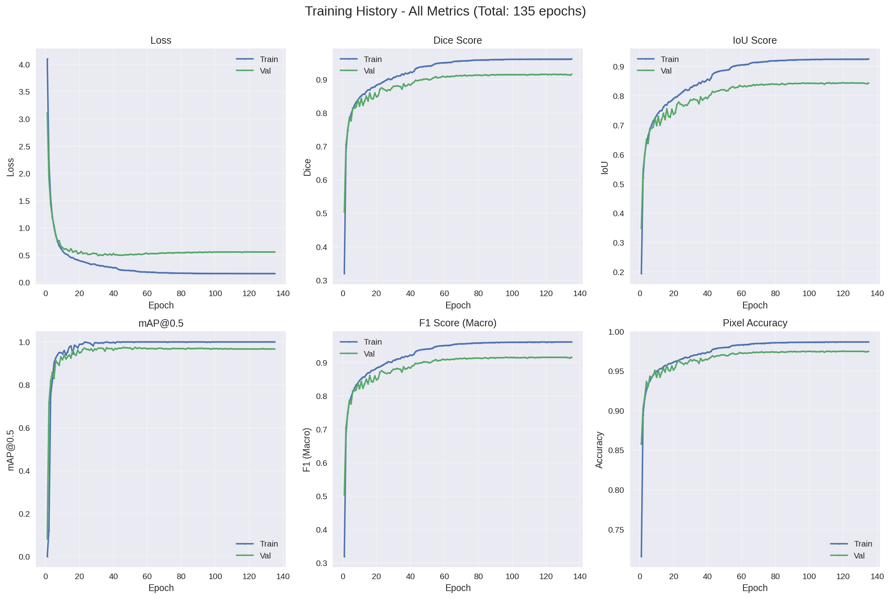

- При анализе работы модели на новых изображениях отмечается:
  - на ортопантомограммах, на которых присутствуют все зубы, модель их все находит, границы зубов не совсем точные, модель как-бы сегментирует с запасом;
  - на ортопантомограммах, на которых присутствуют не все зубы, имеются импланты, коронки - модель начинает путаться в сложных областях

### Выводы

- Использование комбинированной лосс-функции (CE + Dice + Focal) значительно улучшило показатели по сравнению с чистой кросс-энтропией (CE), особенно в метриках Dice и IoU.
- Модели без аугментации показывают формально высокие цифры на валидации, но страдают от быстрого переобучения уже после 20-й эпохи. Введение аугментаций позволило обучать модель дольше (до 135 эпох) и добиться более стабильных и обобщающих результатов.
- Финальная модель показала наивысший показатель mAP@0.5 (0.9911) и высокий Mean Dice, при этом оставаясь стабильной и не демонстрируя признаков критического переобучения, в отличие от ранних попыток.
- Модель настроена так, что она скорее предпочтет выделить чуть большую область под зуб, чем пропустить его часть, видно по macro-метрикам Precision и Recall, а также при инфернсе на новых изображениях.
- Цели исследования достигнуты, метрики на отложенной тестовой выборке достигли Dice = 0.9205, mAP@0.5 = 0.9911. Модель хорошо сегментирет зубы на новых снимках, однако ведет себя нестабильно в областях, где отсутствуют зубы и присутствуют артефакты. 

### Визуализация инференса на новых изображениях

<table>
  <tr>
    <td>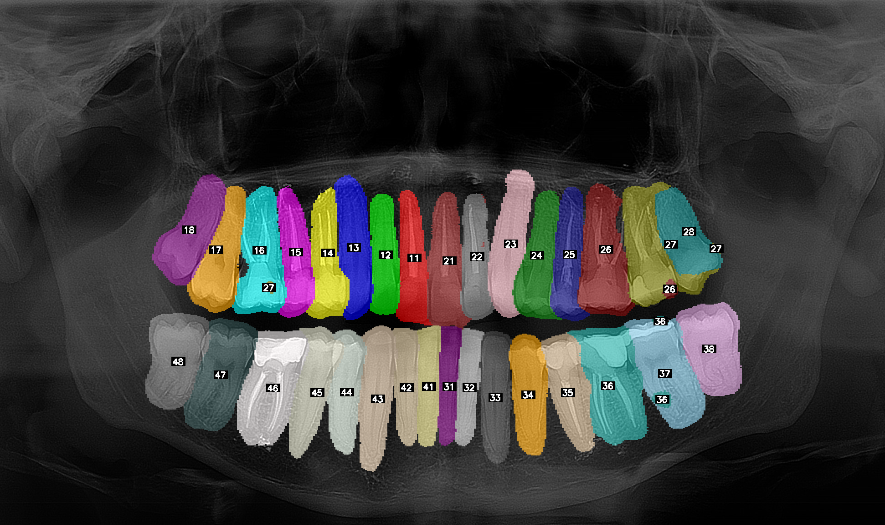</td>
    <td>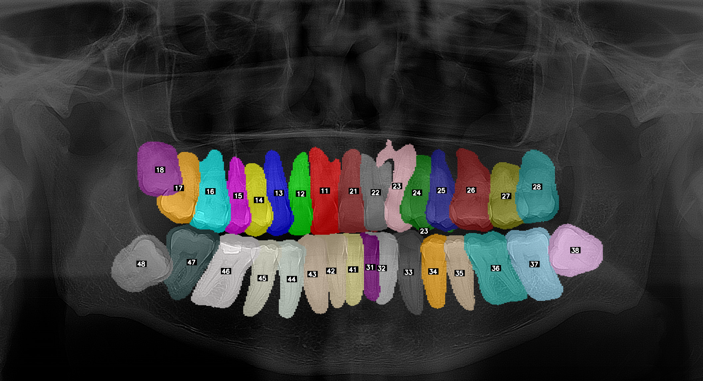</td>
  </tr>
  <tr>
    <td>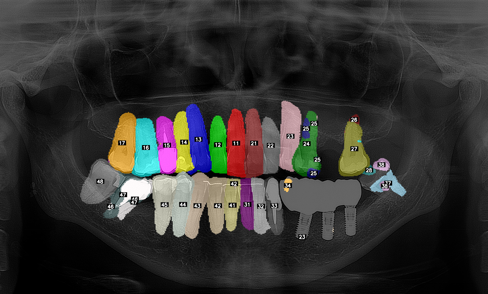</td>
    <td>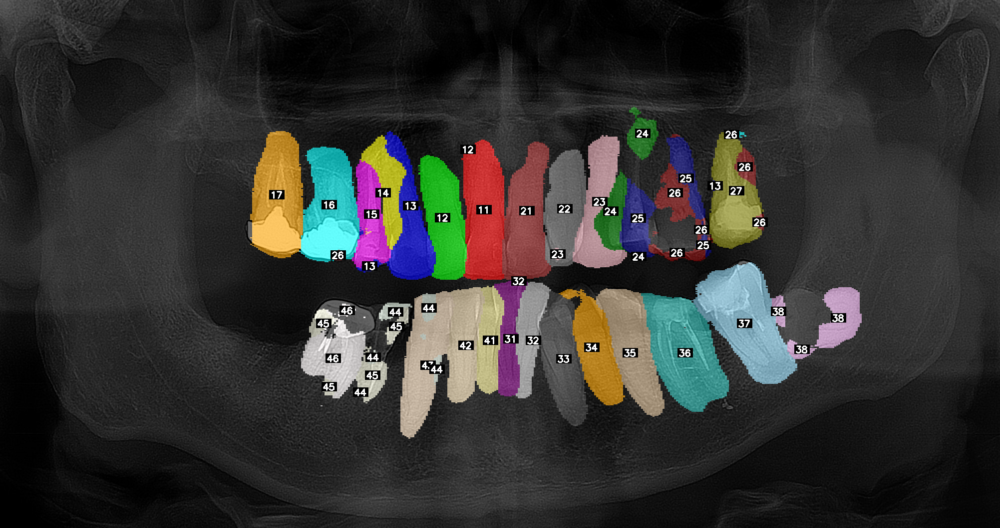</td>
  </tr>
  <tr>
    <td>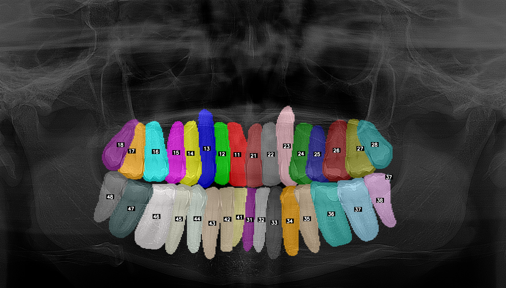</td>
    <td>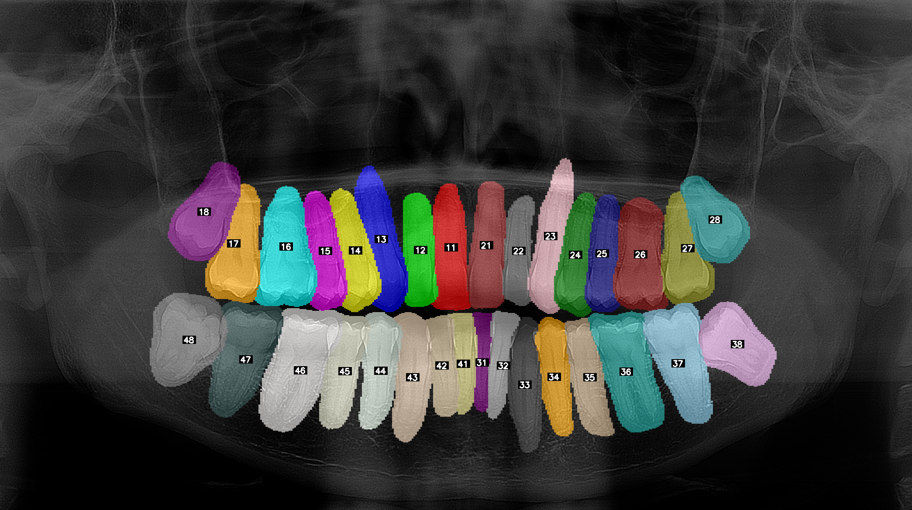</td>
  </tr>
  <tr>
    <td>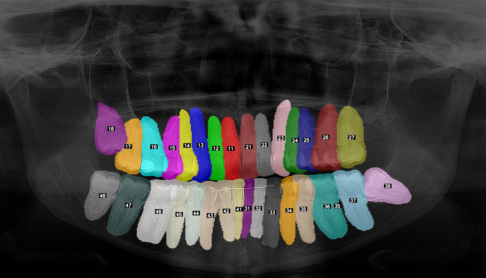</td>
    <td>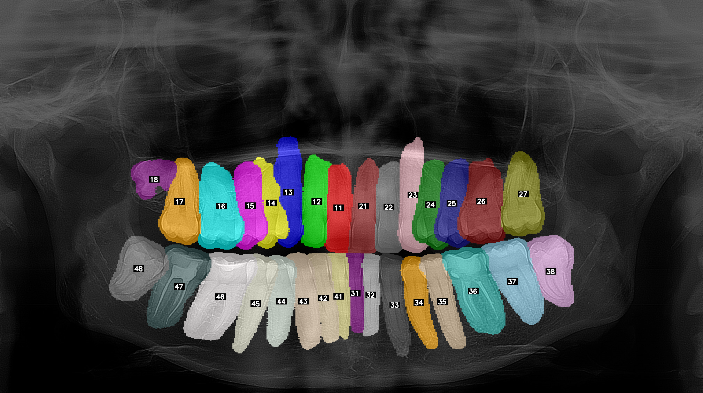</td>
  </tr>
  <tr>
    <td>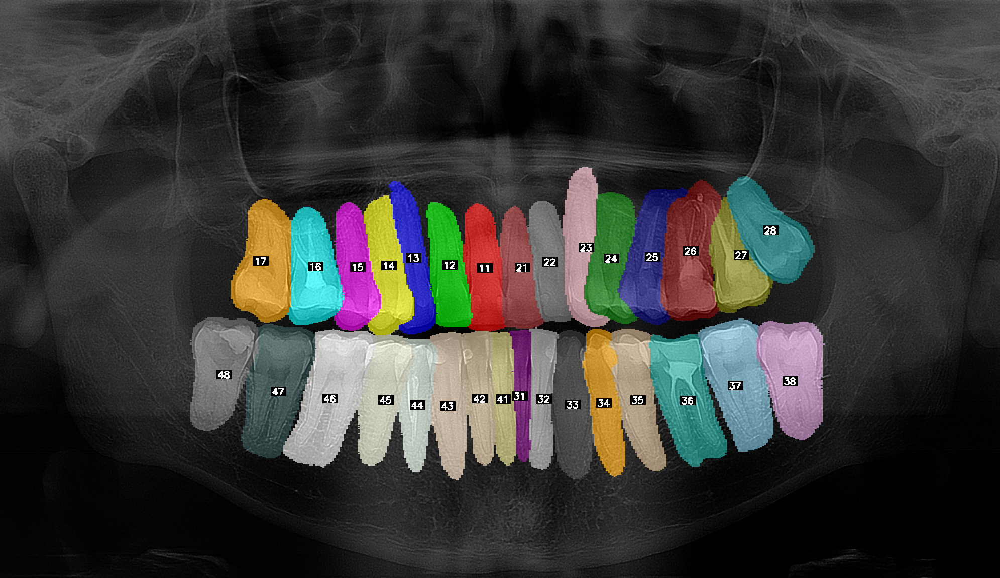</td>
    <td>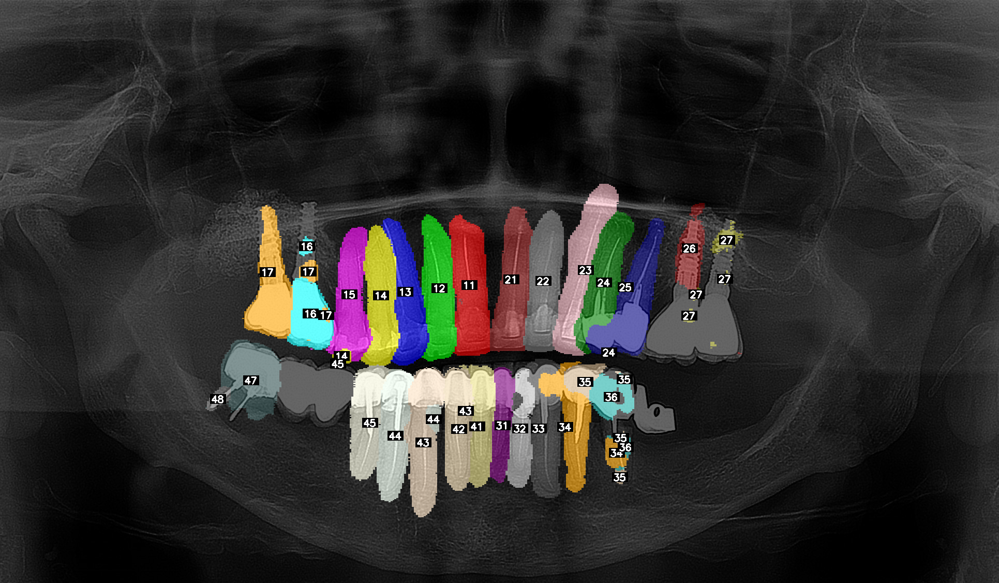</td>
  </tr>
</table>

## Примечание
Так как каждый класс (номер зуба по FDI) представлен на изображении не более чем одним экземпляром, задача в данном разделе свелась к многоклассовой семантической сегментации. В качестве одной из метрик для оценки качества использовался mAP, адаптированный под наш случай: для каждого класса варьировался порог уверенности пиксельной классификации, строилась кривая Precision-Recall и вычислялась площадь под ней. Полученные значения усреднялись по классам. Это позволило оценить способность модели разделять пиксели разных классов при различных уровнях уверенности. Данная адаптированная метрика не является основной, так как решается задача семантической сегментации, а не сегментации экземпляров, однако я считаю ее полезной при сравнении моделей на архитектуре U-Net. Естественно, использовать данную метрику для сравнения с другими архитектурами для инстанс-сегментации будет некорректно.
