# Структура раздела
- `U-Net_encoders.ipynb` - для обучения и инференса моделей на архитектуре U-Net/U-Net++ с энкодерами
- `functions_unet_encoders.py` - функции для обучения и инференса моделей на архитектуре U-Net/U-Net++ с энкодерами
- `/model` - результаты обучения и инференса
- `U-Net_encoders-summary.pdf` - результаты всех экспериментов

# Сегментация зубов на ОПТГ с использованием архитектуры U-Net/U-Net++ с предобученными энкодерами

**Цели исследования**:
- Исследовать влияние различных предобученных энкодеров (ResNet34, ResNet50, EfficientNet‑B3) и архитектур (U‑Net, U‑Net++) на качество сегментации зубов по системе FDI.
- Достичь улучшения метрик по сравнению с базовой U‑Net (Dice > 0.92 (без учета фона)), обученной с нуля, при сохранении или повышении устойчивости к новым данным.

Классическая U‑Net, обученная с нуля, показала высокое качество на тестовой выборке (Dice 0.92), однако её способность к обобщению на новые данные нельзя назвать удовлетворительной. Применение предобученных энкодеров позволяет использовать знания, извлечённые из больших наборов данных, что потенциально улучшает устойчивость модели и качество сегментации, особенно в сложных областях (артефакты, отсутствие зубов и т.д.).

Предобученные энкодеры являются стандартом в задачах компьютерного зрения при ограниченном объеме данных. Они предоставляют богатые иерархические признаки, обученные на миллионах изображений, что позволяет модели быстрее сходиться и лучше обобщать.     
В данной работе использованы:
- Энкодеры на базе ResNet (34, 50) – классические сверточные сети с остаточными связями, хорошо зарекомендовавшие себя в задачах сегментации.
- EfficientNet‑B3 – современная эффективная архитектура, достигающая высокой точности при меньших вычислительных затратах.
- Предобученные веса: ImageNet и SSL (self-supervised learning).

Архитектуры U‑Net и U‑Net++ обеспечивают эффективное восстановление пространственных деталей благодаря пропускным соединениям. Основное отличие U-Net++ от классической U-Net заключается в модификации пропускных соединений (skip-connections) между энкодером и декодером. В стандартной U-Net каждый уровень декодера напрямую объединяется с соответствующим уровнем энкодера посредством конкатенации. В U-Net++ между ними вводится система вложенных сверточных блоков, формирующих так называемые nested skip-connections. Эти промежуточные преобразования постепенно уменьшают семантический разрыв (semantic gap) между признаками энкодера и декодера. В результате декодер получает более согласованные иерархические представления признаков, что в ряде задач медицинской сегментации приводит к повышению точности выделения объектов, особенно в областях границ.

## Методика (дизайн эксперимента)

**Варьируемые условия**:
- Архитектура декодера:
  – U‑Net (базовая)
  – U‑Net++ (с вложенными блоками и плотными пропускными соединениями)
- Энкодер и предобученные веса:
  – ResNet34 (ImageNet)
  – ResNet50 (ImageNet, SSL)
  – EfficientNet‑B3 (ImageNet)
- Функция потерь: комбинированная CE + Dice + Focal с варьированием веса Focal (1.0 и 0.5).
- Аугментации: применялся расширенный набор (геометрические искажения, CLAHE, шум, CoarseDropout).

**Фиксированные условия**:
- датасет: teeth-seg-3537 Computer Vision Model (автор Godento2);
- размер входных изображений: 512×512;
- оптимизатор: AdamW (lr = 0.001, weight_decay = 1e-4);
- планировщик: ReduceLROnPlateau (factor=0.5, patience=10);
- ранняя остановка: отслеживание mean_dice на валидации, patience = 15;
- вычислительная среда: Google Colab (GPU A100 / L4), фиксированный seed;

**Измеряемые показатели**:
- функция потерь на валидации: комбинированная функция потерь: CE + Dice + Focal;
- метрики качества: 
  - основные: Dice, IoU 
  - дополнительные: mAP50, mAP50‑95, пиксельная точность (Accuracy); Precision и Recall (micro и macro усреднение);
- визуальная оценка на новых неразмеченных данных;

**Критерии достижения целей**:
- достижение Dice > 0.92 на тестовой выборке для лучшей модели;
- модель демонстрирует приемлемое качество на новых, ранее не размеченных снимках (отсутствие критического переобучения, оцениваемое экспертно);

**Последовательность экспериментальных шагов**:
- датасет уже разделен на обучающую, валидационную и тестовую подвыборки;.
- обучение моделей с разными энкодерами и архитектурами (50 эпох для первичного сравнения);
- выбор наилучших конфигураций и их дообучение до 150 эпох с ранним остановом;
- оценка на тестовой выборке и анализ метрик;
- визуальный анализ предсказаний на новых снимках;

## Методы исследования

**Использована реализация U‑Net с предобученными энкодерами**:
- архитектура: U-Net, U-Net++
- encoder_name: resnet34, resnet50, efficientnet-b3
- encoder_weights: imagenet, ssl

**Инструменты**:
- программная среда: Google Colab, Python, фреймворк PyTorch, smp;
- аппаратное обеспечение: GPU NVIDIA A100/L4;.
- датасет teeth-seg-3537 Computer Vision Model (автор Godento2);

**Параметры оптимизации**:
- оптимизатор: *AdamW*;
- *learning_rate* = 0.001;
- *weight_decay* = 1e-4, сила регуляризции;
- планировщик скорости обучения: *ReduceLROnPlateau*:
  - *mode*='min', ориентируется на минимизацию валидационной потери);
  - *factor* = 0.5, умножение learning rate на 0.5 при отсутствии улучшений;
  - *patience* = 10, число эпох без улучшения валидационной метрики перед снижением lr;
- *early stopping*:
  - отслеживается метрика *mean_dice* на валидации;
  - *patience* для *early stopping* = 15;

**Анализируемые функции потерь**:
Комбинированная функция потерь: Combined Loss = 1.0 * CE + 1.0 * DiceLoss + 1.0 * FocalLoss.    
Такая комбинация позволяет сочетать преимущества всех трёх подходов: стабильность CE, точность границ от Dice и фокусировку на сложных регионах от Focal. В экспериментах с финальной моделью вес FocalLoss был заменен на 0.5, для сравнения с финальной моделью на архитектуре U-Net.

**Аугментации**:
Для улучшения обобщающей способности модели применялся расширенный набор аугментаций (библиотека Albumentations), которые включали геометрические преобразования, изменения яркости и контраста, добавление шума - подробнее [здесь](https://github.com/drSever/MIPT_X-RayDent/tree/master/01_teeth_segmentation/00_Dataset).
Все аугментации применялись с вероятностями 0.1–0.5, чтобы сохранить естественность изображений.

**Метрики оценки**:
- Качество моделей сравнивалось на отложенной тестовой выборке (модель не видела ее при обучении). 
- Основные метрики: Dice Coefficient, IoU (Jaccard Index) без учета фона.
- Дополнительные метрики: mAP50, mAP50‑95, Precision / Recall (micro и macro), Pixel Accuracy.
- Дополнительно оценивалось качество обученной модели на новых неразмеченных снимках.

## Результаты экспериментов

Всего было обучено 8 моделей на базе архитектуры U-Net, общее время обучения составило более 25 часов на видеокартах A100/L4.

- U-Net с ResNet34/50 (ImageNet): Базовые модели показали Mean Dice в диапазоне 0.8590–0.8634. Отмечалось отсутствие переобучения, но в случае с ResNet50 лосс на валидации в конце обучения падал плохо.
- Переход к SSL (Self-Supervised Learning): Использование весов SSL для ResNet50 в архитектуре U-Net позволило поднять Mean Dice до 0.8740.
- Преимущество U-Net++: Переход на архитектуру U-Net++ (с энкодером ResNet50 и SSL) значительно улучшил результат, достигнув Mean Dice 0.9027 уже на 50 эпохах.
- EfficientNet-B3: Модель с этим энкодером показала стабильное обучение без переобучения, но результат по Dice (0.8549) оказался ниже, чем у связки ResNet50+SSL.
- Лучшие показатели были достигнуты на конфигурации U-Net++ с энкодером ResNet50 (SSL):
  - Mean Dice: 0.9285
  - Mean IoU: 0.8645
  - mAP@0.5: 0.9702
  - Accuracy: 0.9791
  - Precision (micro/macro): 0.9785 / 0.9142
  - Recall (micro/macro): 0.9785 / 0.9407     
Графики обучения финальной модели:
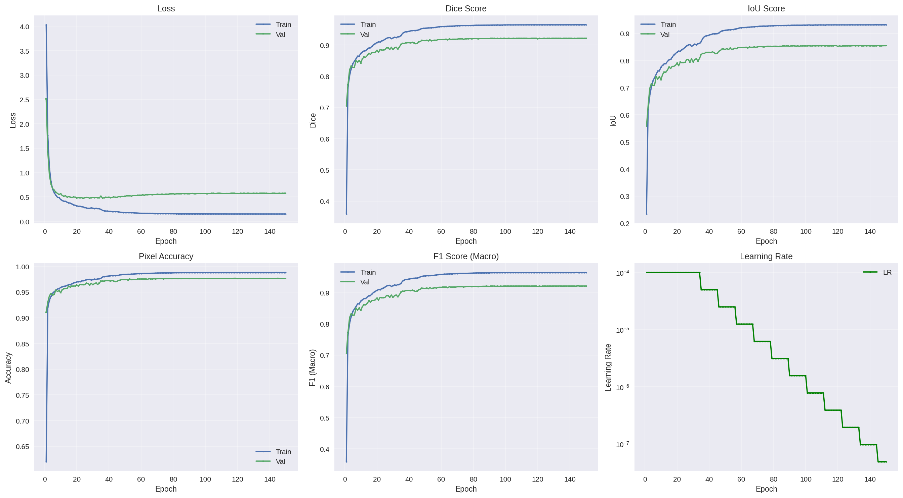
- Замена веса FocalLoss с 1.0 на 0.5 в комбинированной функции потерь в финальной версии модели позволило пройти модели полный цикл обучения без раннего останова. Это также привело к улучшению метрики mAP50‑95 с 0.7406 до 0.7990.

## Выводы
- U-Net++ превосходит стандартный U-Net в данной задаче сегментации.
- Энкодеры с SSL-предобучением показывают себя лучше, чем стандартные ImageNet-веса.
- Все модели демонстрировали высокую стабильность (отсутствие явного переобучения).
- Цели исследования достигнуты, метрики на отложенной тестовой выборке практически достигли Dice ≈ 0.93. Модель хорошо сегментирет зубы на новых снимках, однако ведет себя нестабильно в областях, где отсутствуют зубы и присутствуют артефакты. 

## Визуализация инференса на новых изображениях

<table>
  <tr>
    <td>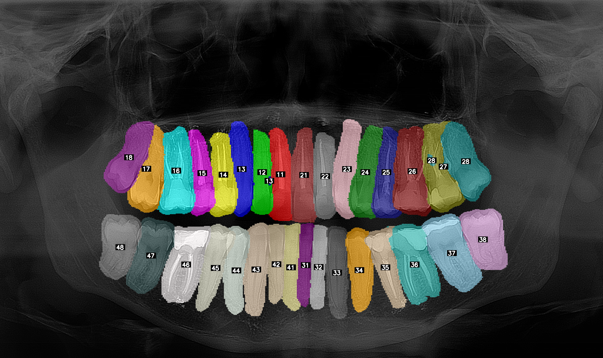</td>
    <td>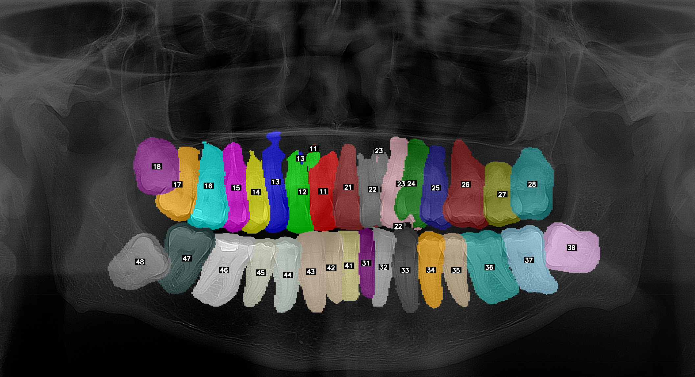</td>
  </tr>
  <tr>
    <td>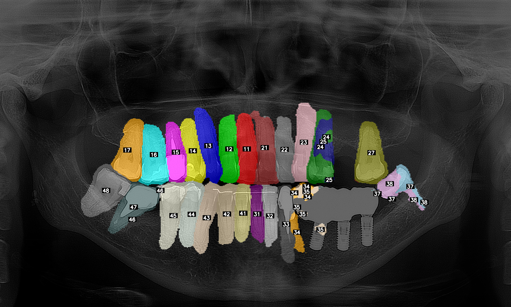</td>
    <td>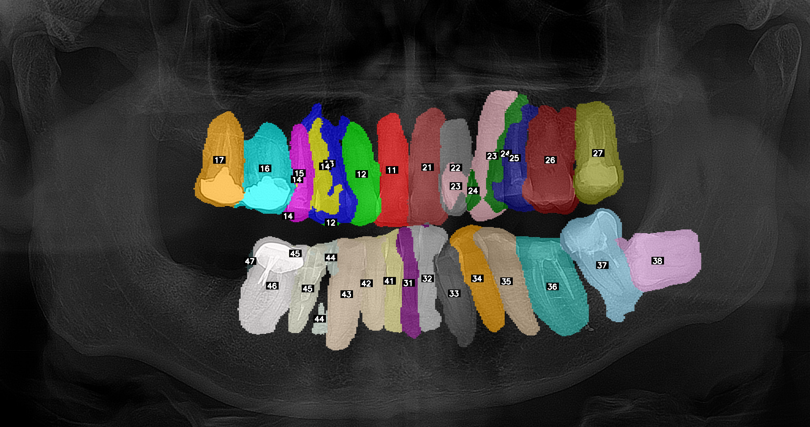</td>
  </tr>
  <tr>
    <td>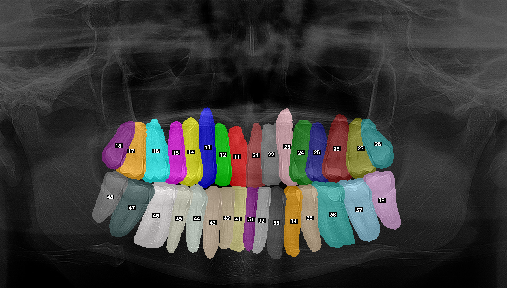</td>
    <td>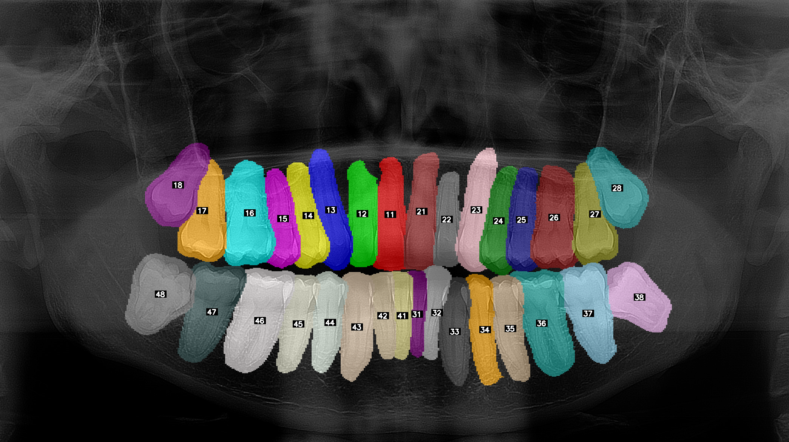</td>
  </tr>
  <tr>
    <td>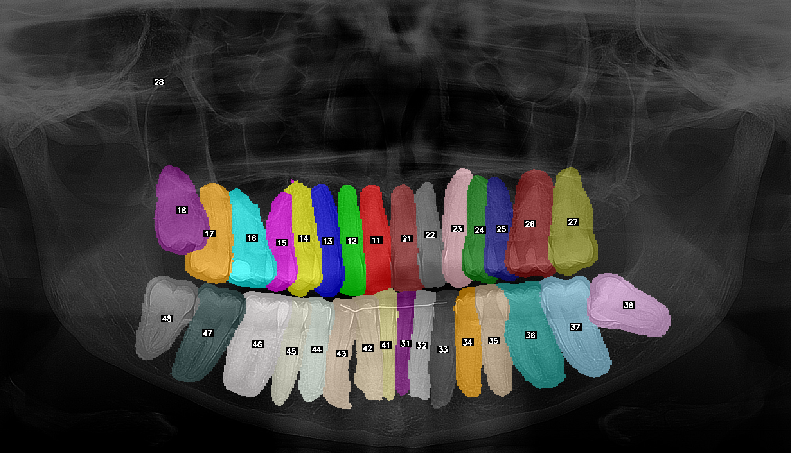</td>
    <td>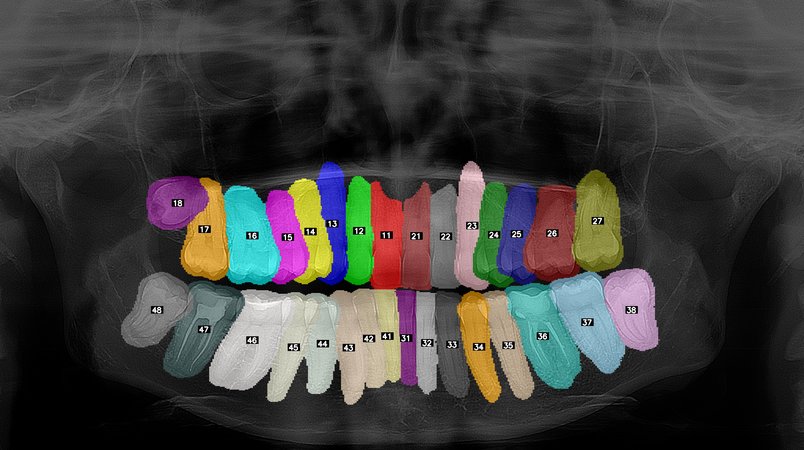</td>
  </tr>
  <tr>
    <td>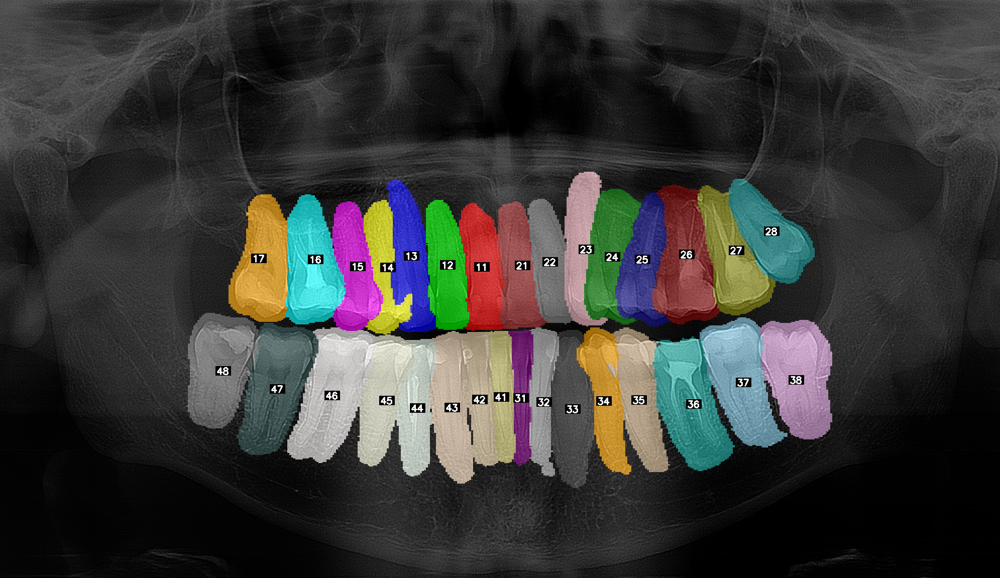</td>
    <td>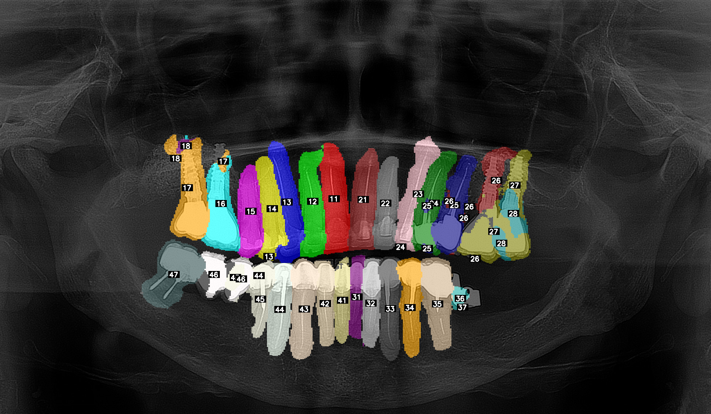</td>
  </tr>
</table>

