# Сегментация зубов на ОПТГ с использованием архитектуры Mask R-CNN
## Структура раздела
- `MaskRCNN_Detectron2.ipynb` - для обучения и инференса модели на архитектуре Mask R-CNN ResNeXt-101-32x8d-FPN
- `augmentations.py` - скрипт для аугментаций изображений перед подачей в модель
- `evaluate_model.py` - скрипт для оценки модели на тестовой подвыборке
- `inference_maskrcnn.py` - скрипт для инференса на новых изображениях
- `train_maskrcnn.py` - скрипт обучения
- `visualize_training.py` - скрипт для визуализации истории обучения
- `/model` - результаты обучения и инференса
- `MaskRCNN_TorchVision_summary.pdf` - результаты экспериментов Mask R-CNN ResNet-50-FPN v1/v2

**Цели исследования**:
- Исследовать влияние разных экстракторов (backbone) и используемых фреймворков в моделях на основе архитектуры MaskRCNN на качество сегментации зубов.
- Достичь метрик mAp50 > 0.95 и Dice > 0.9 при сохранении устойчивости модели к новым данным.

## Методика (дизайн эксперимента)

**Варьируемые условия**:
- Backbones:
  - ResNet-50-FPN v1 (TorchVision, 50 слоев)
  - ResNet-50-FPN v2 (TorchVision, 50 слоев)
  - ResNeXt-101-32x8d-FPN (Detectron2, 101 слой)

**Фиксированные условия**:
- датасет: teeth-seg-3537 Computer Vision Model (автор Godento2);
- вычислительная среда: Google Colab, фиксированный seed;
- аугментации

**Критерии достижения целей**:
- достижение mAP50 > 0.95, Dice > 0.90 на отложенной тестовой выборке для лучшей модели;
- модель демонстрирует приемлемое качество на новых, ранее не размеченных снимках (отсутствие критического переобучения, оцениваемое экспертно);

**Последовательность экспериментальных шагов**:
- датасет уже разделен на обучающую, валидационную и тестовую подвыборки;.
- обучение моделей с разными backbones;
- оценка на тестовой выборке и анализ метрик;
- визуальный анализ предсказаний на новых снимках;

## Методы исследования

**Использована реализация Mask R-CNN**:
- ResNet-50-FPN v1 (TorchVision, 50 слоев)
- ResNet-50-FPN v2 (TorchVision, 50 слоев)
- ResNeXt-101-32x8d-FPN (Detectron2, 101 слой)

**Инструменты**:
- программная среда: Google Colab, Python, фреймворк PyTorch, TorchVision, Detectron2;
- аппаратное обеспечение: GPU NVIDIA A100.

**Параметры оптимизации**:
- Параметры оптимизации (ResNet-50-FPN v1/v2):
  - оптимизатор: SGD;
  - learning_rate = 5e-4;
  - momentum=0.9;
  - weight_decay = 0.0005, сила регуляризции;
  - планировщик скорости обучения: StepLR (step=10, gamma=0.1);
  - warmup: нет;

- Параметры оптимизации (ResNeXt-101-32x8d-FPN):
  - оптимизатор: SGD;
  - learning_rate = 2.5e-4;
  - momentum=0.9;
  - weight_decay = 0.0001, сила регуляризции;
  - планировщик скорости обучения: MultiStep (60% и 80% от max_iter, gamma=0.1);
  - warmup: 500 итераций;

**Аугментации**:
Для улучшения обобщающей способности модели применялся расширенный набор аугментаций (библиотека Albumentations), которые включали геометрические преобразования, изменения яркости и контраста, добавление шума - подробнее [здесь](https://github.com/drSever/MIPT_X-RayDent/tree/master/01_teeth_segmentation/00_Dataset).
Все аугментации применялись с вероятностями 0.1–0.5, чтобы сохранить естественность изображений.

**Метрики оценки**:
- Качество моделей сравнивалось на отложенной тестовой выборке (модель не видела ее при обучении). 
- Основные метрики: mAP50, Dice Coefficient, IoU (Jaccard Index).
- Дополнительные метрики: Precision / Recall.
- Дополнительно оценивалось качество обученной модели на новых неразмеченных снимках.

## Результаты экспериментов

Всего было обучено 3 модели на базе архитектуры U-Net, общее время обучения составило более 50 часов на видеокартах A100.

- **MaskRCNN ResNet-50-FPN v1** (TorchVision): 
  - очень длительное время обучения (30 эпох на A100 за 22.5 часа), за этот период по графикам loss не отмечено переобучения достигнутые значения метрик:
    - mAP50: 0.9764
    - Dice: 0.7773
    - Precision: 0.62
    - Recall: 0.90
  - учитывая длительность обучения и небольшой вероятностью достижения целевых значений метрик (оценено по графикам) дальнейшее обучение прекращено

- **MaskRCNN ResNet-50-FPN v2** (TorchVision): 
  - очень длительное время обучения (30 эпох на A100 за 22.5 часа), за этот период по графикам loss не отмечено переобучения достигнутые значения метрик:
    - mAP50: 0.9823
    - Dice: 0.8234
    - Precision: 0.70
    - Recall: 0.90
  - по достигнутым значениям метрик модель обошла ResNet-50-FPN v1 однако, учитывая длительность обучения и небольшой вероятностью достижения целевых значений метрик (оценено по графикам) дальнейшее обучение прекращено

- **MaskRCNN ResNeXt-101-32x8d-FPN** (Detectron2):
  - обучение длилось 10000 итераций (92.54 эпох), время обучения составило примерно 5 часов
  - графики демонстрируют отсутствие переобучения
  - достигнутые значения метрик:
    - mAP50: 0.9757
    - Dice: 0.91
    - Precision (micro/macro): 1.00
    - Recall (micro/macro): 0.99
  - по достигнутым значениям метрик модель обошла ResNet-50-FPN v1/v2 р
  - при оценке на новых изображениях - лучшее качество среди всех обученных моделей
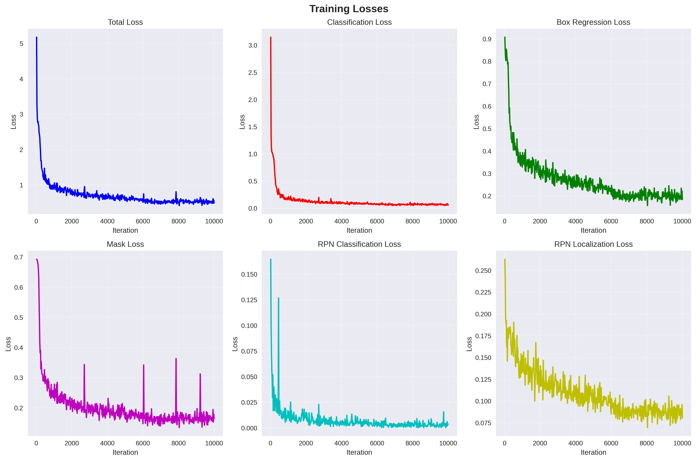
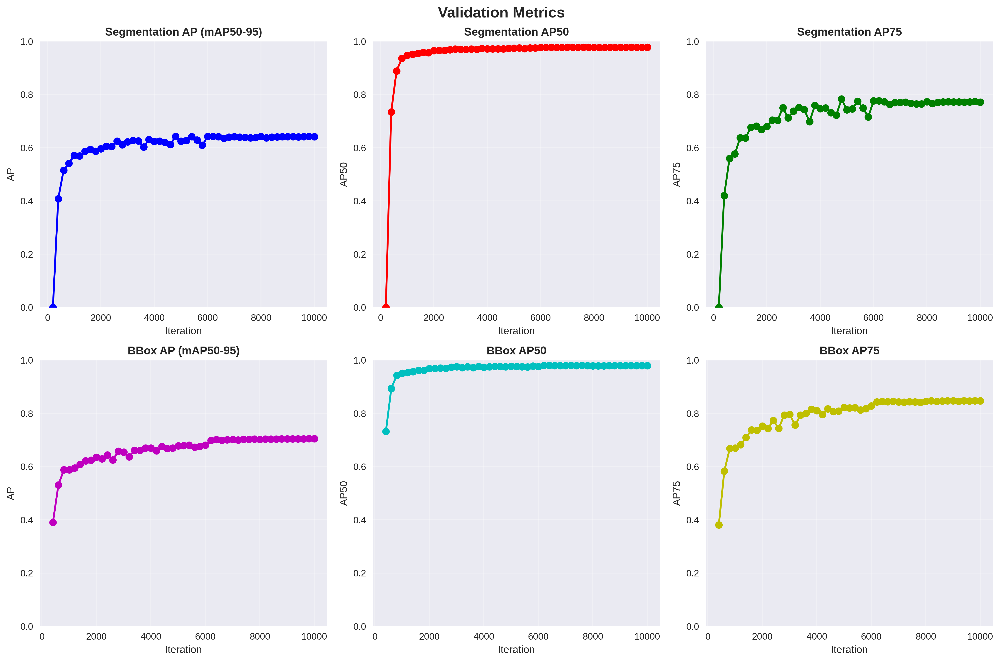

## Выводы
- MaskRCNN ResNet-50-FPN v1/v2  в реализации TorchVision не достигли поставленных целей, отмечается их медленное обучение.
- MaskRCNN ResNeXt-101-32x8d-FPN в реализации Detectron2 достигла значений целевых мктрик.
- На новых нразмеченных данных показало наилучшее качество среди всех обученных моделей.

## Визуализация инференса на новых изображениях

<table>
  <tr>
    <td>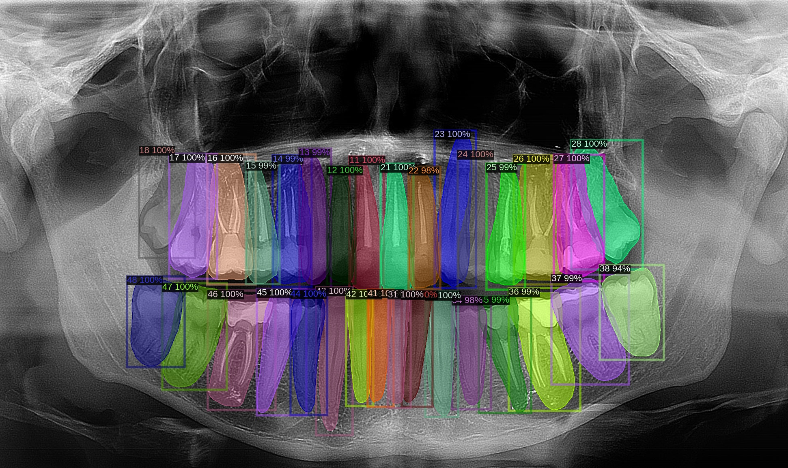</td>
    <td>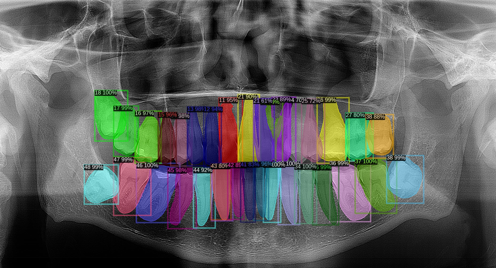</td>
  </tr>
  <tr>
    <td>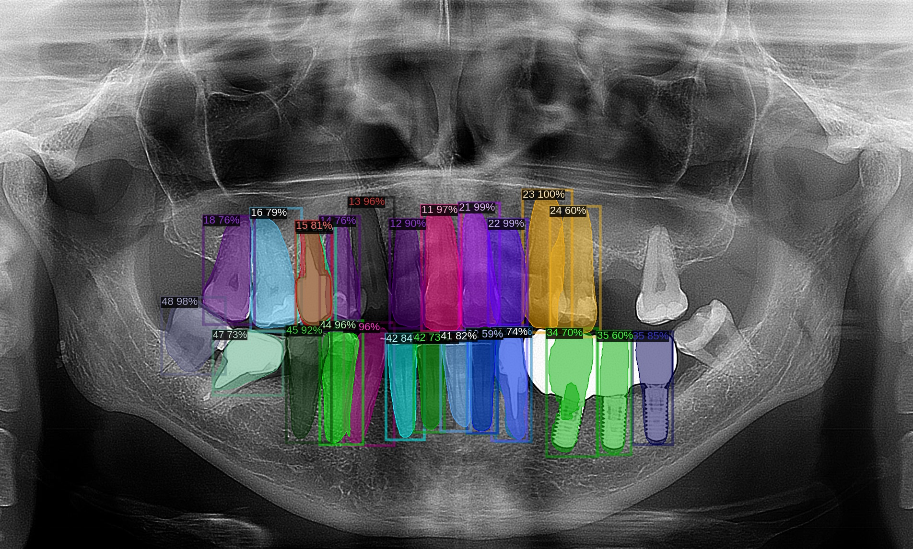</td>
    <td>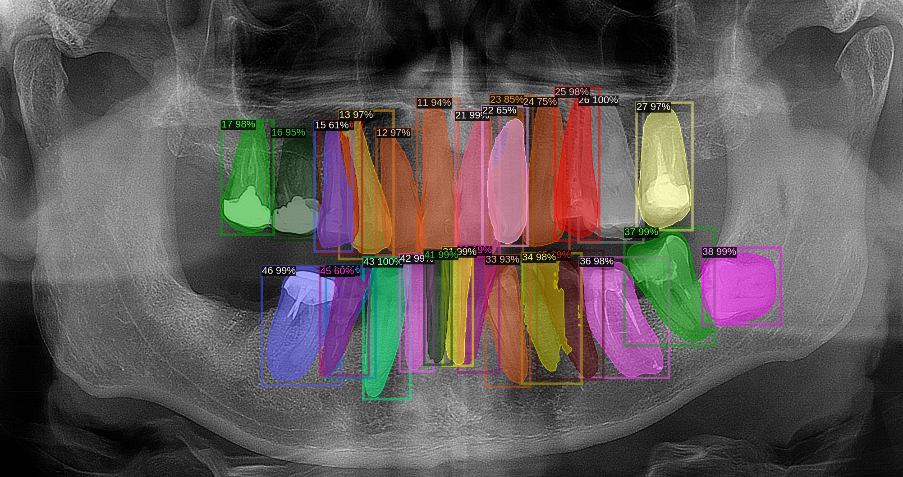</td>
  </tr>
  <tr>
    <td>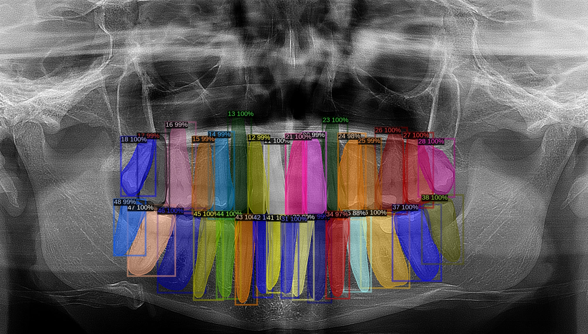</td>
    <td>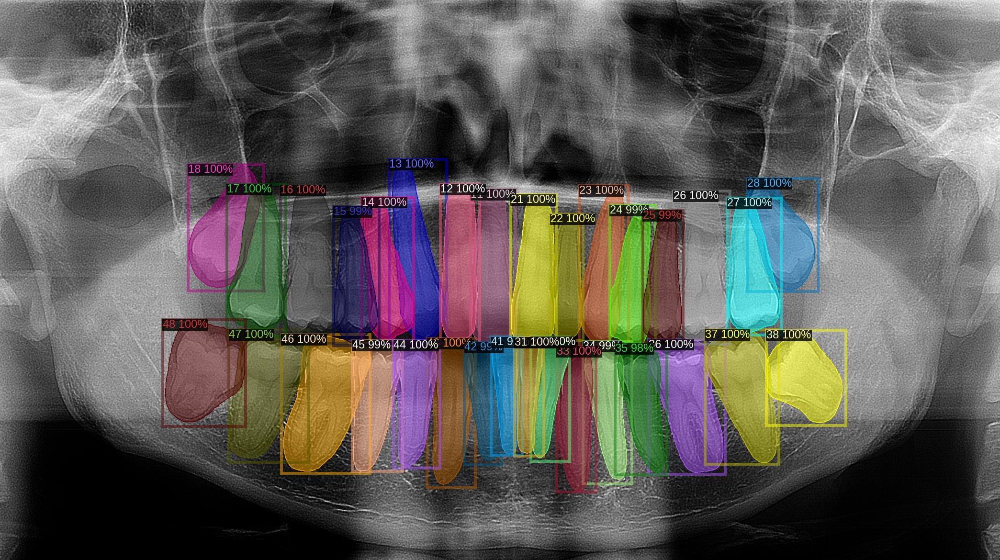</td>
  </tr>
  <tr>
    <td>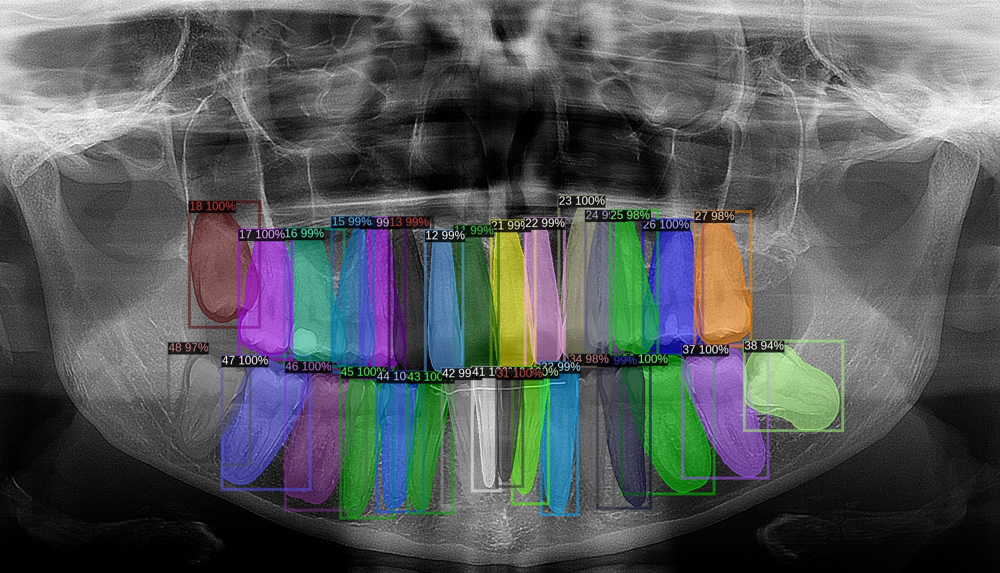</td>
    <td>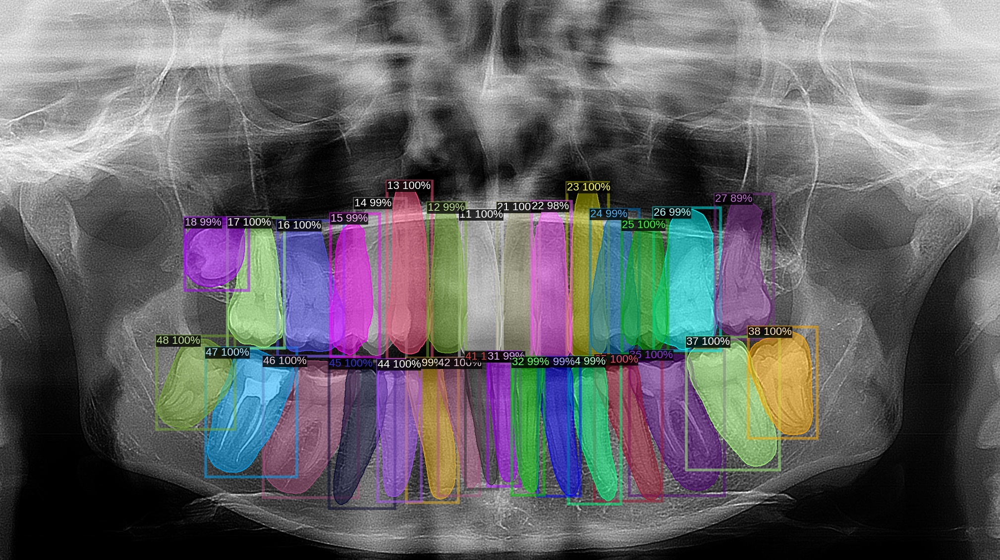</td>
  </tr>
  <tr>
    <td>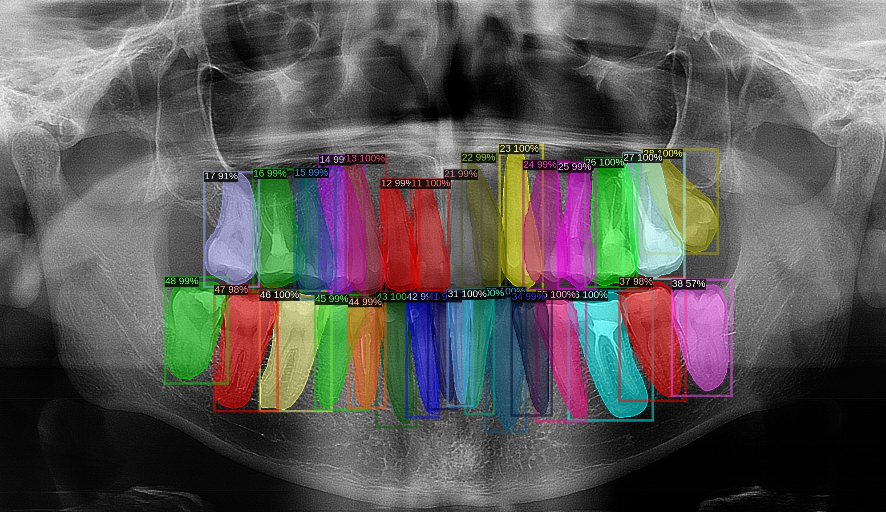</td>
    <td>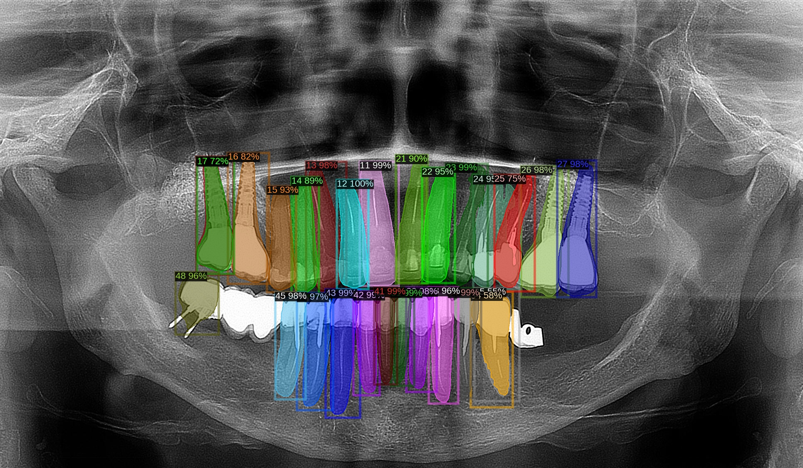</td>
  </tr>
</table>

