# Сегментация зубов на ОПТГ с использованием архитектуры Mask R-CNN + Swin Transformer
## Структура раздела
- `MaskRCNN_Detectron2_ST.ipynb` - для обучения и инференса модели на архитектуре Mask R-CNN + Swin Transformer
- `augmentations.py` - скрипт для аугментаций изображений перед подачей в модель
- `evaluate_model.py` - скрипт для оценки модели на тестовой подвыборке
- `inference_maskrcnn.py` - скрипт для инференса на новых изображениях
- `train_maskrcnn.py` - скрипт обучения
- `visualize_training.py` - скрипт для визуализации истории обучения
- `/model` - результаты обучения и инференса

**Цели исследования**:
- Улучшить качество сегментации зубов на новых ортопантомограммах, по сравнению с Mask R-CNN + ResNeXt-101-32x8d-FPN

## Методика (дизайн эксперимента)

**Фиксированные условия**:
- backbone: Swin Transformer (swin_base_patch4_window7_224)
- датасет: teeth-seg-3537 Computer Vision Model (автор Godento2);
- вычислительная среда: Google Colab, фиксированный seed;
- аугментации + гоизонтальный флип с зеркальной заменой классов по FDI;

**Критерии достижения целей**:
- улучшение значений метрик, по сравнению с Mask R-CNN + ResNeXt-101-32x8d-FPN;
- модель демонстрирует более высокое качество на новых сложных снимках (оцениваемое экспертно);

**Последовательность экспериментальных шагов**:
- датасет уже разделен на обучающую, валидационную и тестовую подвыборки;.
- обучение модели;
- оценка на тестовой выборке и анализ метрик;
- визуальный анализ предсказаний на новых снимках;

## Методы исследования

### Архитектура модели

#### Общая схема

```
Входное изображение
       ↓
  Swin Transformer (backbone)
       ↓
  Feature Pyramid Network (FPN)
       ↓
  Region Proposal Network (RPN)
       ↓
  ROI Heads (bbox + mask)
       ↓
  Предсказания: bbox + маска + класс FDI
```

#### Backbone: Swin Transformer Base

| Параметр | Значение |
|---|---|
| Модель | `swin_base_patch4_window7_224` |
| Источник весов | timm (Microsoft, ImageNet-1k pretrain) |
| Лицензия весов | MIT |
| Параметры backbone | ~88M |
| Patch size | 4×4 пикселя |
| Window size | 7×7 патчей |
| Выходные каналы стадий | 128 -> 256 -> 512 -> 1024 |
| Strides стадий | 4 -> 8 -> 16 -> 32 |

**Почему Swin, а не ResNeXt:**
Swin Transformer использует self-attention в скользящих окнах (Shifted Window Attention),
что позволяет модели учитывать глобальный контекст — взаимное расположение зубов в ряду.
Это важно для корректной классификации по FDI: отличить зуб 14 от 15 без понимания
соседних зубов затруднительно. 

ResNeXt видит только локальные паттерны через свёртки.

Pretrain на ImageNet-1k (1.3M изображений).     
Если нужен более богатый pretrain — можно использовать `swin_base_patch4_window7_224.ms_in22k`
(ImageNet-21k, 14M изображений), изменив `SWIN_MODEL_NAME` в ноутбуке.    
**Важно**: в данном случае не совсем понятна лицензия (возможность использования в коммерческих целях).

**Gradient Checkpointing:** включён по умолчанию — снижает потребление VRAM примерно вдвое.

#### Neck: Feature Pyramid Network (FPN)

Объединяет feature maps всех 4 стадий Swin в единую пирамиду признаков.
Все уровни проецируются в 256 каналов через lateral convolutions.
Выходные уровни: P2, P3, P4, P5, P6 (P6 — MaxPool от P5).

#### Head: Mask R-CNN

Стандартный двухэтапный детектор:
1. **RPN** — генерирует proposals (регионы-кандидаты)
2. **ROI Heads** — классифицирует proposals и предсказывает маски

| Параметр | Значение |
|---|---|
| Batch size per image (ROI) | 128 |
| NMS threshold (test) | 0.3 |
| Score threshold (test) | 0.5 |
| Post-NMS proposals (test) | 1000 |
| Post-NMS proposals (train) | 2000 |

#### Anchor Generator

| Параметр | Значение |
|---|---|
| Sizes (по уровням FPN) | [32], [64], [128], [256], [512] |
| Aspect ratios | [0.5, 1.0, 2.0] |

---

### Оптимизация

#### Оптимизатор: AdamW

AdamW выбран вместо SGD как стандарт для Transformer-based моделей.
Адаптирует learning rate для каждого параметра индивидуально,
weight decay применяется корректно — отдельно от градиентного шага.

| Параметр | Значение |
|---|---|
| Оптимизатор | AdamW |
| Weight decay | 0.05 |
| Weight decay для bias/norm | 0.0 (отключён) |
| Gradient clipping | norm, max_norm=1.0 |

#### Learning Rate Schedule

| batch_size | base_lr | warmup_iters |
|---|---|---|
| 2 | 0.0001 | 500 |
| 4 | 0.0002 | 500 |
| 8 | 0.0004 | 1000 |
| 16 | 0.0008 | 1000 |

- **Warmup:** линейный рост от 0 до `base_lr` за `warmup_iters` итераций
- **Decay:** ×0.1 на 60% и 80% от `max_iter` (Step LR)

#### Нормализация входа

Модель ожидает RGB изображение, нормализованное по ImageNet статистике:
- Mean: [123.675, 116.280, 103.530]
- Std: [58.395, 57.120, 57.375]

---

### Аугментации

Применяются только на train, реализованы через [Albumentations](https://albumentations.ai/).

| Аугментация | Параметры | Вероятность |
|---|---|---|
| Горизонтальный flip | с зеркальной заменой FDI номеров (1<->2, 3<->4 квадрант) | 0.5 |
| Affine | scale ±5%, translate ±3%, rotate ±3° | 0.5 |
| ElasticTransform | alpha=0.5, sigma=25 | 0.1 |
| CLAHE | clip_limit=2.0, tile_grid=(8,8) | 0.5 |
| RandomBrightnessContrast | ±8% | 0.5 |
| CoarseDropout (чёрный) | 1-2 артефакта, 2-4% размера | 0.05 |
| CoarseDropout (серый) | 1-2 артефакта, 2-4% размера | 0.05 |
| CoarseDropout (белый) | 1-2 артефакта, 2-4% размера | 0.05 |
| GaussNoise | std 0.01-0.04 | 0.2 |

**Горизонтальный flip** реализован отдельно от остальных аугментаций,
потому что требует замены category_id: при флипе левая и правая стороны меняются местами,
поэтому квадрант 1 (зубы 11-18) <-> квадрант 2 (21-28), квадрант 3 (31-38) <-> квадрант 4 (41-48).

---

### Балансировка классов (Class Weights)

В датасете присутствует дисбаланс — зубы мудрости (18, 28, 38, 48) встречаются реже.
Опционально можно включить взвешенный classification loss.

| Метод | Формула | Когда использовать |
|---|---|---|
| `inverse_freq` | weight = 1 / count | сильный дисбаланс |
| `sqrt_inverse_freq` | weight = 1 / √count | умеренный дисбаланс (рекомендуется) |
| `effective_samples` | ENS формула | сложный дисбаланс |

Параметр `class_weight_power` усиливает веса: `final_weight = weight ^ power`.

---

#### Руководство по Class Weights для балансировки редких зубов

В датасете зубов есть дисбаланс, что приводит к:
- Модель хуже детектирует зубы мудрости
- Низкий AP для редких классов
- Больше false negatives на зубах мудрости

Class weights увеличивают вес loss для редких классов, заставляя модель уделять им больше внимания.

##### Методы вычисления весов

1. **Inverse Frequency** (сильная балансировка)

`class_weight_method='inverse_freq'`    
Формула: `weight = 1 / count`

Характеристики:
- Максимальное внимание к редким классам
- Сильная балансировка    
**НО**:
- Риск переобучения на редких классах
- Может снизить качество на частых классах

Когда использовать:
- Очень сильный дисбаланс
- Критически важны редкие классы
- Baseline показывает очень плохие результаты

2. **Square Root Inverse Frequency** (умеренная балансировка)

`class_weight_method='sqrt_inverse_freq'`     
Формула: `weight = 1 / sqrt(count)`

Характеристики:
- Умеренная балансировка
- Баланс между частыми и редкими классами
- Меньше риск переобучения
- Хорошо работает в большинстве случаев

Когда использовать:
- Умеренный дисбаланс
- Нужен баланс качества на всех классах 

3. **Effective Number of Samples** (адаптивная балансировка)

`class_weight_method='effective_samples'`     
Формула: `weight = (1 - beta) / (1 - beta^count)` где beta = 0.9999

Характеристики:
- Адаптивная балансировка
- Учитывает общее количество образцов
- Теоретически обоснованный метод
- Более сложный

Когда использовать:
- Сложный дисбаланс (разные соотношения)
- Нужен более "умный" подход
- `sqrt_inverse_freq` не дал результата

### Параметр усиления (power)

`class_weight_power=1.5`       
Формула: `final_weight = weight^power`

Когда использовать
- `1.0`	Стандартные веса.	Baseline
- `1.5`	Умеренное усиление. Редкие классы все еще плохо детектируются
- `2.0`	Сильное усиление.	Журтвуем качеством на частых классах

---

### Метрики оценки

#### Основные метрики 
- **Segmentation AP (mAP50-95)** — основная метрика
- **Segmentation AP50** — IoU threshold 0.5
- **Segmentation AP75** — IoU threshold 0.75
- **BBox AP** — качество детекции

#### Дополнительные метрики 
- **Dice** — качество сегментации масок
- **IoU** — пересечение над объединением масок
- **Precision / Recall / F1** — по каждому классу FDI
- Вычисляются при IoU@0.5 и IoU@0.75

**Важно:** 
- FP приписывается классу предсказания модели,
- FN — классу ground truth. 
- TP засчитывается только при совпадении класса и IoU ≥ threshold.

## Результаты экспериментов

-

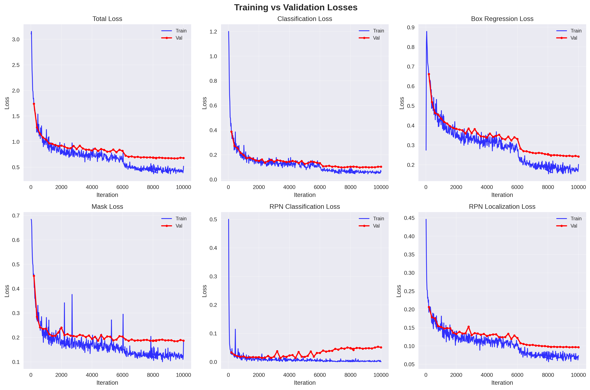
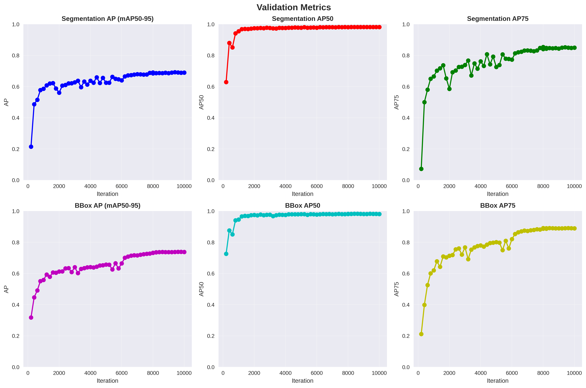


## Выводы
- 


## Визуализация инференса на новых изображениях

<table>
  <tr>
    <td>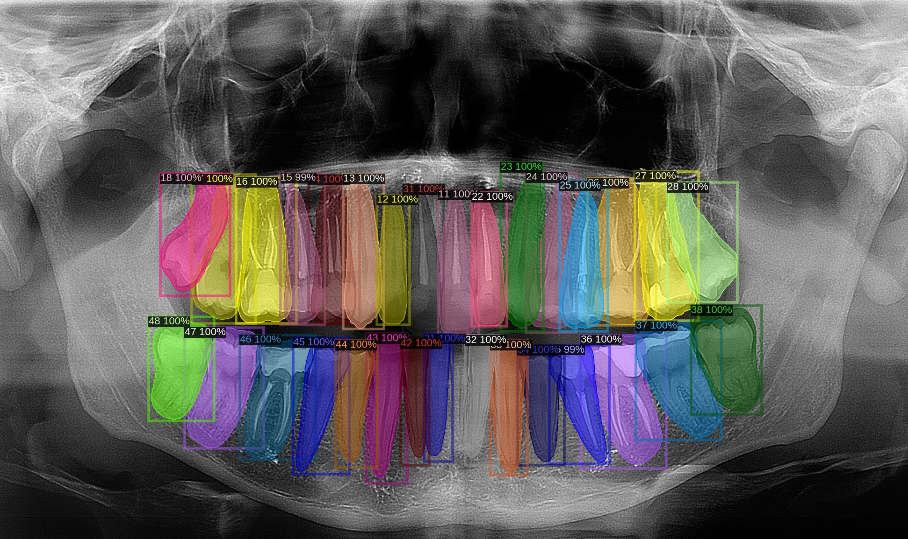</td>
    <td>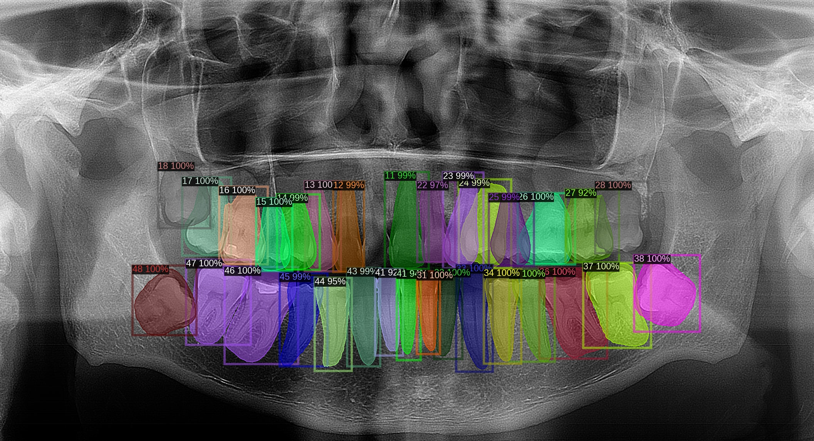</td>
  </tr>
  <tr>
    <td>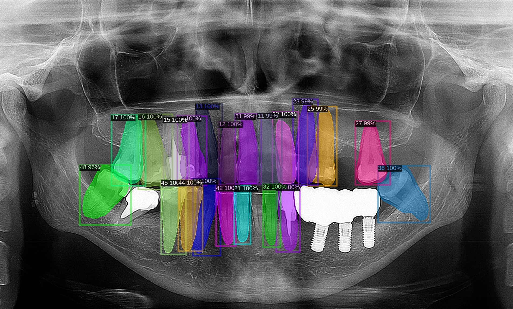</td>
    <td>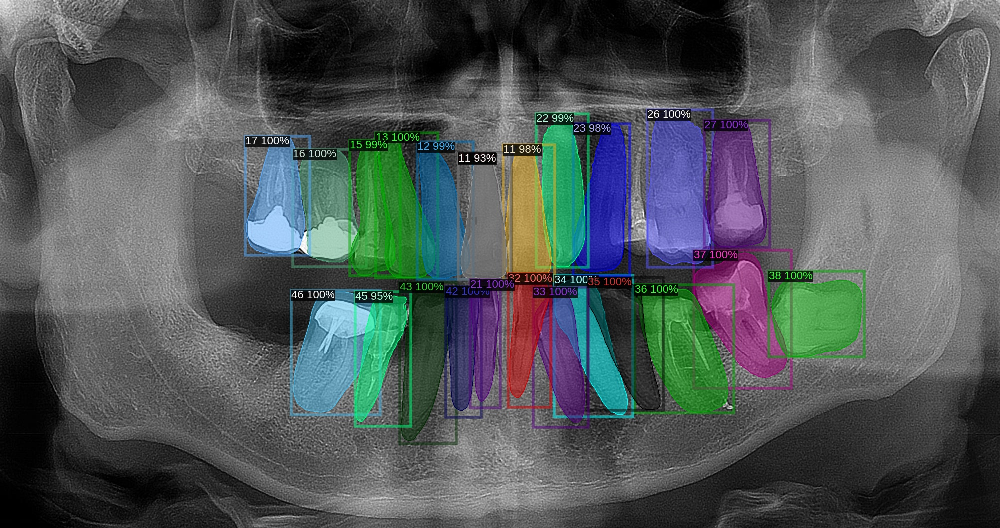</td>
  </tr>
  <tr>
    <td>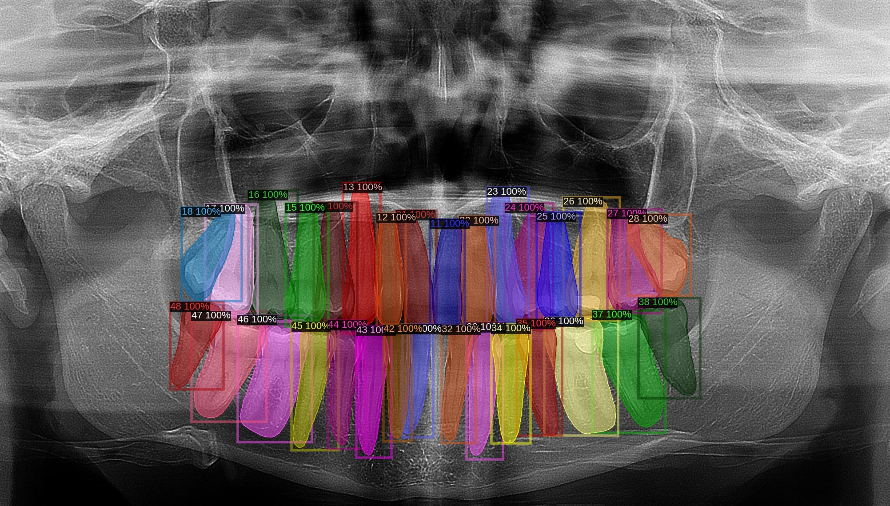</td>
    <td>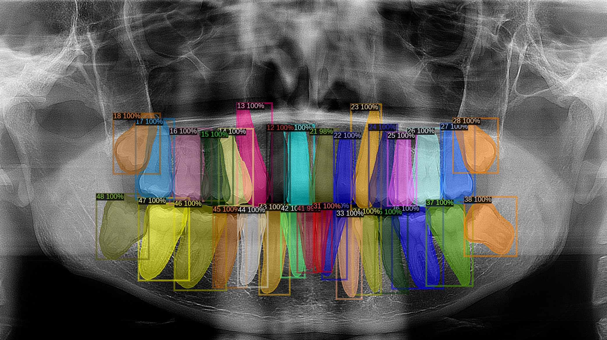</td>
  </tr>
  <tr>
    <td>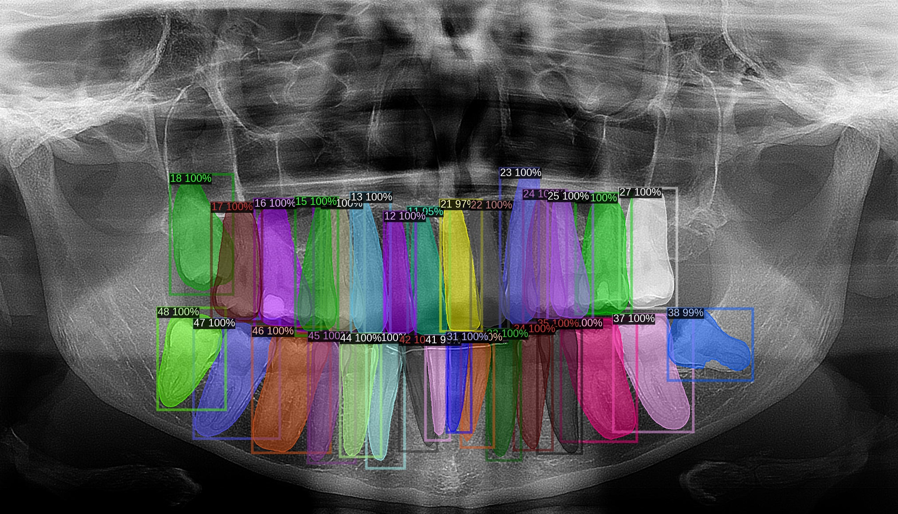</td>
    <td>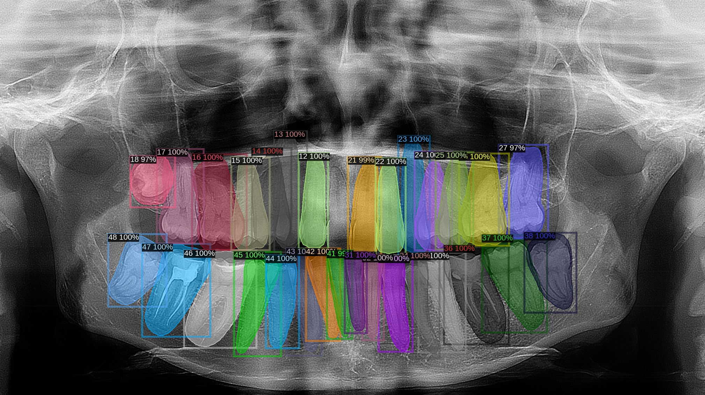</td>
  </tr>
  <tr>
    <td>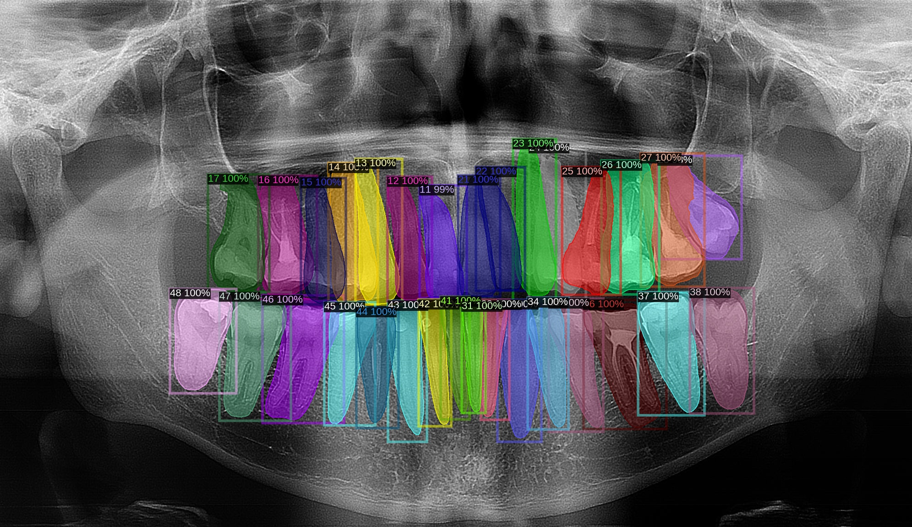</td>
    <td>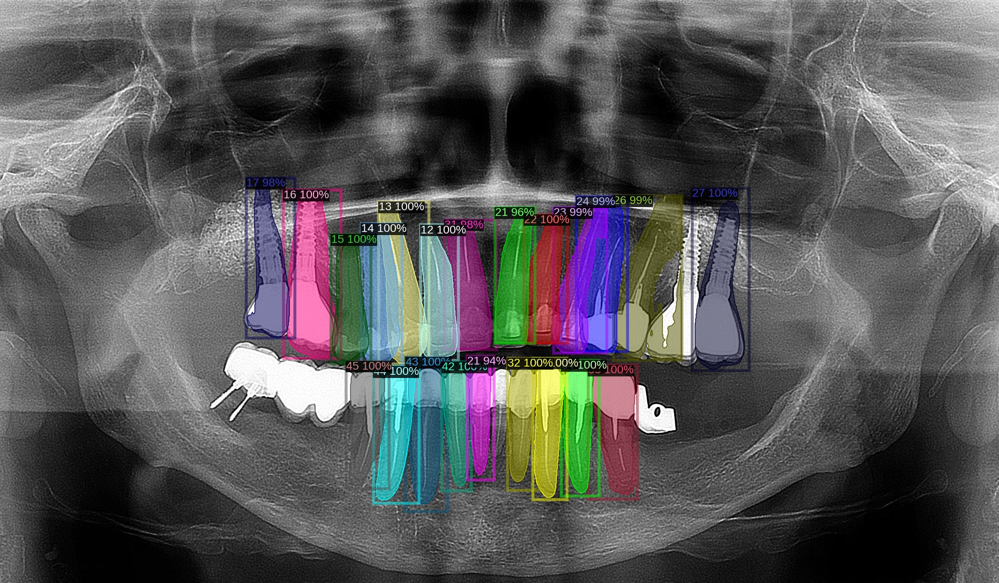</td>
  </tr>
</table>

