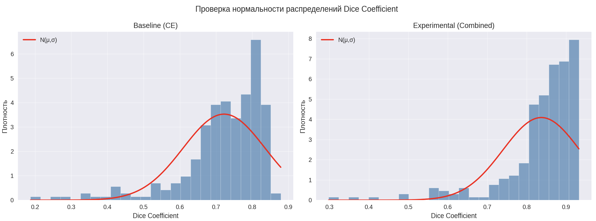

# Проверка гипотез
## Структура 
- `01_hypothesis.ipynb` - проверка гипотезы №1
- `requirements_1.txt` - зависимости для проверки гипотезы №1

## Гипотеза 1
### Формулировка гипотезы
Применение **комбинированной функции потерь** на основе взвешенной суммы **CrossEntropy Loss + Dice Loss + Focal Loss** приведет к статистически значимому улучшению сегментации зубов на ОПТГ, что проявится в увеличении среднего значения метрики **Dice Coefficient** не менее, чем на **5%** по сравнению с базовой моделью, использующей только CrossEntropy Loss.
### Теоретическое обоснование:
Использование комбинированной функции потерь обеспечивает синергетический эффект: CrossEntropy стабилизирует процесс обучения и обеспечивает качественную пиксельную классификацию, Dice Loss напрямую оптимизирует целевую метрику и устойчив к дисбалансу классов, а Focal Loss улучшает сегментацию граничных областей и сложных случаев за счёт фокусировки на трудно классифицируемых примерах.

### Методика (дизайн эксперимента)

**Варьируемые условия**:
- функции потерь:
  - только кросс‑энтропия (CE) для baseline-модели;      
  - комбинированная функция потерь: CE + Dice + Focal с весовыми коэффициентами 1.0, 1.0, 0.5 соответственно для экспериментальной модели;

**Фиксированные условия**:
- датасет: teeth-seg-3537 Computer Vision Model (автор Godento2), содержащий ортопантомограммы с разметкой зубов по системе FDI;
- размер входных изображений: 512×512 пикселей;
- архитектура модели: классическая U‑Net с 4 уровнями;
- оптимизатор: AdamW с начальной скоростью обучения 0.001;
- вычислительная среда: Google Colab (GPU A100) с фиксированным seed;
- количество эпох для основных сравнений: 20;
- аугментации: отсутствуют;
- seed.

**Измеряемые показатели**:
- функция потерь на валидации:
  - кросс‑энтропия (CE);
комбинированная функция потерь: CE + Dice + Focal;
метрики качества: Dice

**Последовательность экспериментальных шагов**:
- подготовка данных: датасет уже разделен на обучающую, валидационную и тестовую подвыборки;
- обучение baseline-модели с функцией потерь CE и без аугментаций;
- обучение экспериментальной модели с комбинированной функцией потерь (CE+Dice+Focal) без аугментаций;
- сбор метрик и значений функций потерь после каждого эксперимента;
- сравнительный анализ;

### Методы исследования
Использована **классическая реализация U‑Net**:

Encoder: четыре блока DoubleConv (две свёртки 3×3 + BatchNorm + ReLU), каждый с увеличением числа каналов: 64 -> 128 -> 256 -> 512. После каждого блока применяется MaxPooling 2×2.
Bottleneck: блок DoubleConv с 1024 каналами.
Decoder: четыре блока, каждый включает транспонированную свертку (увеличение разрешения), конкатенацию с соответствующим skip‑connection, затем DoubleConv с уменьшением числа каналов вдвое.
Выходной слой: свертка 1×1 с числом каналов, равным количеству классов (33: фон + 32 зуба).

**Инструменты**:
- программная среда: Google Colab, Python, фреймворк PyTorch;
- аппаратное обеспечение: GPU NVIDIA A100;
- датасет teeth-seg-3537 Computer Vision Model (автор Godento2);

**Анализируемые функции потерь**:
- Cross‑Entropy Loss (CE): стандартная функция потерь для пиксельной классификации. Чувствительна к дисбалансу классов, поскольку вклад каждого класса пропорционален числу его пикселей. В задачах сегментации это может приводить к недостаточному учету малых объектов.
- Комбинированная функция потерь:
Combined Loss = 1.0 * CE + 1.0 * DiceLoss + 0.5 * FocalLoss.
Такая комбинация позволяет сочетать преимущества всех трёх подходов: стабильность CE, точность границ от Dice и фокусировку на сложных регионах от Focal.

**Аугментации: отсутствуют**;

### Результаты
- Значение Dice baseline = 0.7221, Dice experimental = 0.8371.
- Сравнение производилось после 20 эпох обучения, дальше начиналось переобучение обеих моделей.    
- Распределение значений метрик Dice Coefficient было не нормальным:

- Не нормальность распределений было подтверждено тестом Шапиро-Уилка
- После применения критерия Вилкоксона (Уилкоксона) разница признана статистически значимой (p<0.05).
- **Гипотеза подтверждена**.